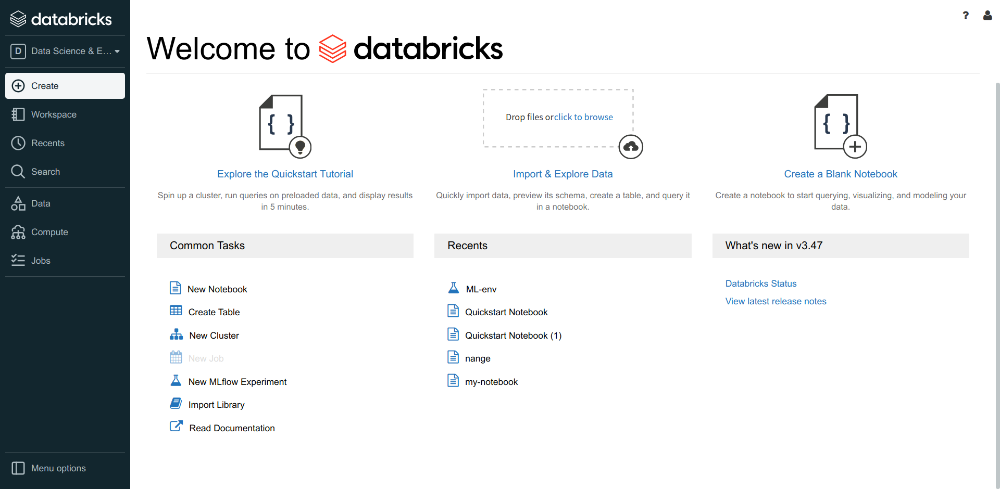
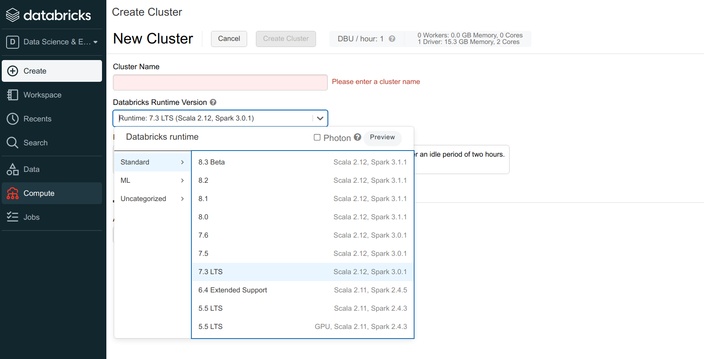
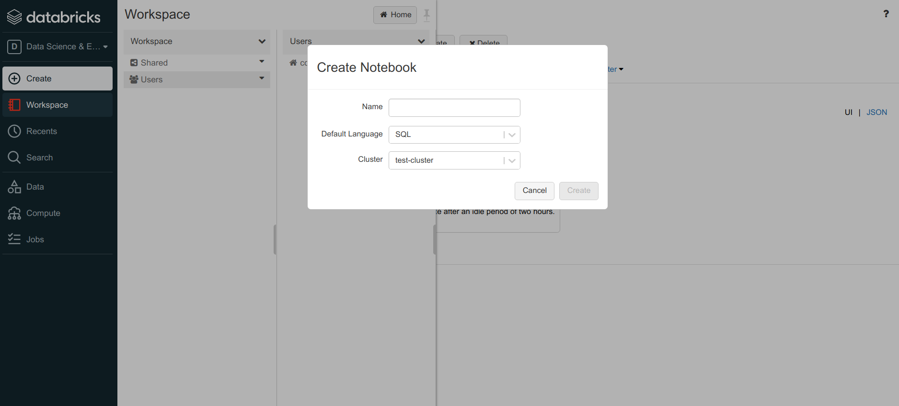
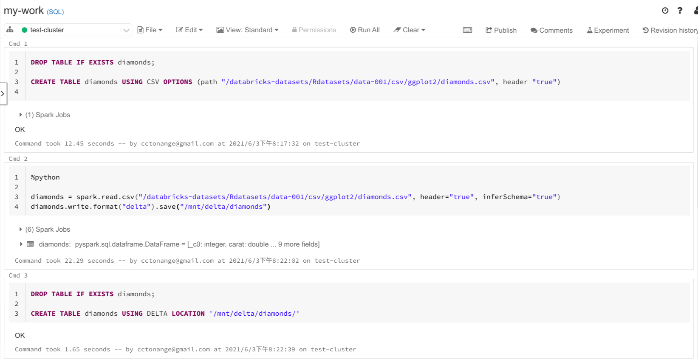
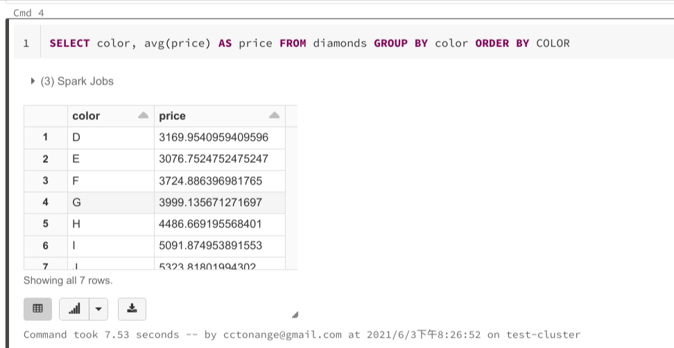

## 整体用户界面

第一感受，功能上没有Snowflake直观。 不过首页上，有个Quickstart Tutorial，可以帮助使用者快速感受这个产品。

## 常规操作
### 创建集群（计算资源）

在“Compute”菜单下，创建集群，目的是创建计算资源，后续实际的数据导入，数据查询，数据分析等需要选择具体的计算资源。

### 创建一个notebook(工作薄)

在“Workspace”菜单下，创建一个Notebook，通常一个Notebook对应一件你具体想去做的事情。 需要指定一个计算资源Cluster。

### 创建表(导入数据)
有多种方式可以导入数据，这里展示两种：使用csv文件、delta文件创建表

### 查询数据

查询数据后，可以点击左下角图标按钮，生成对应各种的图标。

以上就是Databricks的最基础的操作，还有很多高级功能并没有涉及到，包括机器学习等等。
总的来说，Databricks就是建立在上面提到的几个开源软件的基础上，提供了易用的用户界面，帮助用户进行数据分析，机器学习等操作。当然也可以应用程序直接连接。

## 从Databricks中获得的启发
通过组合开源软件，当然自己对对应的开源软件有足够的掌握度，以此为基础，提供云服务，进行盈利。 这给我们未来的商业模式也指明了方向。

另外一点是基于S3，这样的对象存储，在数据分析场景也能实现ACID事务，并且很有用。
