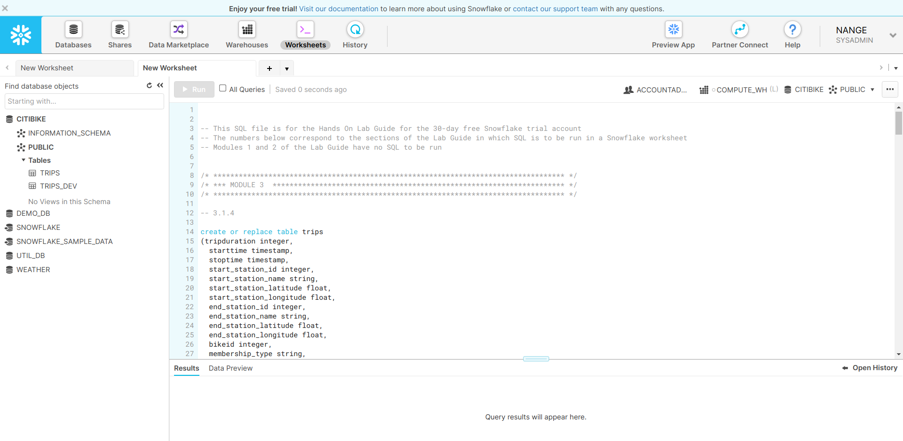

## 整体用户界面


整体看上去这个产品非常简洁，顶部一排按钮是大的功能分类。

**Database**: 展示创建的数据库列表。 此界面能够执行创建、删除、从外部文件加载数据等操作。

**Shares**: 管理数据共享。 此界面能够管理数据库和表的对外共享，以及外部共享进来的数据库和表。

**Data Marketplace**: 数据市场。 可以在此界面，查看其他组织共享的数据。 能进行数据共享申请。

**Warehouses**: 虚拟仓库。 此界面可配置和管理计算资源，用来Snowflake加载和查询数据。 

**Worksheets**: 工作空间。 此界面可以执行具体SQL查询，DDL，DML操作，并且能够查看查询或操作的结果。

**History**: 历史操作记录。 记录之前14天的所有操作及执行情况。

## 常见操作
### 加载数据
Snowflake支持将本地或公有云上的文件数据导入到其内部表中，支持的文件格式有：CSV，JSON，XML，Parquet，ORC，Avro。

具体操作步骤：
1. 在Database菜单目录下，创建一个数据库。
2. 在对应数据库下，创建表，此操作可通过，在Database菜单目录下，可视化的界面操作，也可以在Worksheets工作空间中，执行SQL创建。
   （本质上几乎所有功能的操作都可以通过SQL进行，图形化的方式只是为了提高易用性，图形化操作本质上也都是转换为SQL然后执行的）
3. 创建一个外部阶段（Stage）。 此操作是在具体的一个数据库下创建的。
   由于我们是从外部导入数据，如S3上，则需要定义相应的文件对象路径，Secret key等。同时通过创建这样一个Stage，后续就能够持续重用此对象。
4. 创建文件格式。 因为是从外部文件，如CSV导入数据，因此需要定义此文件格式的一些元信息，如是否压缩，列分隔符等等。
5. 创建计算资源“Warehouses”。 主要是配置计算资源的性能，从低到高有多种可选择。
6. 执行数据导入操作。 可以通过图形化的方式导入数据，也可以执行SQL命令，导入数据。 SQL语句示例：`copy into trips from @citibike_trips
   file_format=CSV;`

从操作看，步骤还是挺多的，但其实很多步骤都只需要操作一次，后续如果还有类似需求，都不用重复执行。 所以整体还是很便捷的。

### 数据查询分析
在Worksheets界面中，可以交互式的执行各种SQL查询语句，进行数据分析。 结果将实时展示，可以下载查询结果，也可以生成对应图表。

### Clone a Table（复制表）
Snowflake可以实现Zero-Copy的模式去复制一个表。 即我们复制一个表后，数据大小不会成倍的增加，只会发生一些元信息的变动。 

一个典型的应用场景是：把线上的数据Clone一份，用于测试环境测试，对Clone数据的修改，不会影响到线上数据。 
具体实现原理可以做一个猜测：由于S3上数据的不可变性，Clone类似于给文件创建了一个硬连接，并不会发生数据的复制，对数据的修改，也是生成新的文件。

### 对半结构化数据JSON的查询支持
导入JSON数据到一张表中，需要创建一个表，其一个字段的类型为`variant`，其可用于存储JSON类型数据。
其他导入操作和之前导入CSV的数据类似。

对JSON数据的查询示例如下：
```sql
select
 v:time::timestamp as observation_time,
 v:city.id::int as city_id,
 v:city.name::string as city_name,
 v:city.country::string as country,
 v:city.coord.lat::float as city_lat,
 v:city.coord.lon::float as city_lon
from json_weather_data
where city_id = 5128638;
```

Snowflake也支持视图(View)，可以对上面的查询创建一个视图，在通过视图去查询，会更方便。
同时JSON数据也可以和其他表进行关联(Join)查询。

### 数据闪回（Time Travel）
Snowflake时间闪回功能允许在一个预配置的时间范围内，访问任意时间点的历史数据。 默认的时间范围是24小时，企业版可以提高到90天。

一些典型的应用场景包括：
1. 恢复可能被意外或有意删除的与数据相关的对象(表、模式和数据库)
2. 从过去的一个关键点复制和备份数据
3. 在特定的一个时间段内分析数据使用

几个典型的操作：
```sql
/* 1. Drop and Undrop a Table */
drop table json_weather_data;
undrop table json_weather_data;

/* 2. Roll Back a Table */
/* 如果真实环境里面误操作执行了这样的操作，通常我们会赶紧去处理数据，并希望有一个备份数据在。 
   但在Snowflake中只需要简单的一条语句就可以恢复 */
update trips set start_station_name = 'oops'; 

set query_id = 
(select query_id from table(information_schema.query_history_by_session (result_limit=>5))
where query_text like 'update%' order by start_time limit 1);

create or replace table trips as 
(select * from trips before (statement => $query_id));

```

### 数据共享
Snowflake能够方便的允许账号和账号之间的数据共享。 
数据所有者可以选择具体的表数据进行共享，潜在的数据消费者可以在共享市场里面发起数据共享请求，等待数据所有者的同意。

Snowflake数据共享的几个关键点：
* 仅有一份数据拷贝，其位于数据提供者的账户内
* 共享的数据总是实时的，消费者可以立即获取到
* 数据提供者可以创建撤销，以及细粒度的控制共享的授权
* 数据共享是简单的安全的。特别是和老的数据共享方式相比，之前的方式通常是手动的，需要在网络上传输大的csv文件等方式，并且很可能是不安全的。

注意：目前仅支持同一个公有云的提供商和同一个Region内的数据进行共享。

Snowflake还提供了多种数据安全共享的方式，而不会损害数据的机密性。 
不止可以共享表(tables)和视图(views)，而且可以共享安全视图(Secure Views)、安全自定义函数(User Defined Functions)以及安全连接(Secure Joins)。


## 从Snowflake中获得的启发
### 技术架构上
#### Shared Nothing架构和Shared Disk架构的融合
将数据存储本身和服务进程完全分离，大多数数据都存储在S3这样的对象存储中，本地磁盘作为S3数据一层缓存。 这样就同时具备了两种架构的优势。

对应到时序数据里面，最近的数据就是我们需要缓存的数据，这更简单了，可以把最近的数据放入本地磁盘，超过指定时间的数据异步移动到对象存储中，
这也是分级存储的思想，这样可以在成本和性能之间做到最大的平衡。 

#### 标准SQL的重要性
在后Hadoop时代，新的数据分析产品，数据仓库等，越来越重视和依赖标准SQL和数据库进行数据管理和分析。 
这是最方便最自然的方式，同时和生态产品可以更好的结合。 
支持了标准SQL，时序数据库和分析型数据库也就完成了融合，
我们自己的产品，应该是以时序数据或者物联网数据作为切入点，根本上还是一款分析型数据库(OLAP)，同时为时序数据做了特殊优化。
当然从更长远来看，支持OLTP也是可以的，但那是后话。 还有一个注意点是，分析型数据库也是可以支持事务的。 

### 商业上
Snowflake从产品上看，和我们公司的云链产品，有很多相似的地方。 
而Snowflake是一个市值达600-700亿美元的产品，其肯定是有我们能够借鉴的地方的。
Snowflake从本质上来看，可以认为是一款数据库产品，其底层有一个强大的数据库做支撑取支持上面的各种功能。 

这也给海东青数据库商业化指明了方向：
底层的核心数据库产品可以开源，基于底层核心数据库，构建的商业上或者说企业级更需要的功能，就可以拿去卖， 包括但不限于产品本身，云服务等模式。
