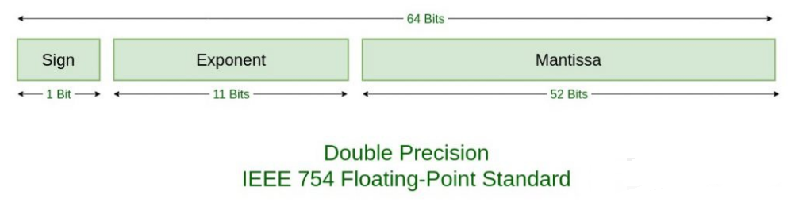
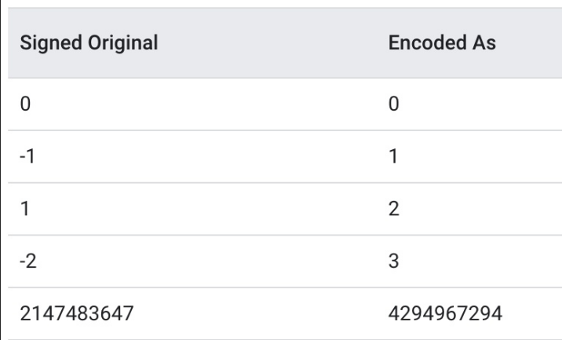
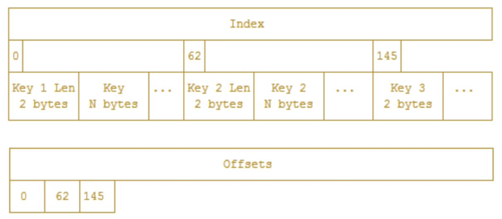

# TSM问题总结

通过回答问题的方式学习TSM文件。
TSM(Time-Structured Merge Tree)对应于LSM结构的最底层数据存储。

## tsm文件结构是怎么样的？

每个TSM文件由四个部分组成：header,blocks,index,footer：
```markdown
+--------+------------------------------------+-------------+--------------+
| Header |               Blocks               |    Index    |    Footer    |
|5 bytes |              N bytes               |   N bytes   |   4 bytes    |
+--------+------------------------------------+-------------+--------------+
```

Header部分是由一个magic number（用以标记文件类型）和一个version number组成：
```markdown
+-------------------+
|      Header       |
+-------------------+
|  Magic  │ Version |
| 4 bytes │ 1 byte  |
+-------------------+
```

Blocks是一系列连续的 CRC32 checksums 和块数据。块数据对文件是不透明的，CRC32是用于块级别的错误检测。
块长度存储在index中。
```markdown
+--------------------------------------------------------------------+
│                           Blocks                                   │
+---------------------+-----------------------+----------------------+
|       Block 1       |        Block 2        |       Block N        |
+---------------------+-----------------------+----------------------+
|   CRC    |  Data    |    CRC    |   Data    |   CRC    |   Data    |
| 4 bytes  | N bytes  |  4 bytes  | N bytes   | 4 bytes  |  N bytes  |
+---------------------+-----------------------+----------------------+
```

```markdown
+--------------------------------------------------------------------+
│                           Data bytes                               │
+---------------------+-----------------------+----------------------+
|   Data Type    |    Timestamp Len   |   Ts Bytes   |  Values Bytes |   
|   1 bytes      |    varint bytes    |    N bytes   |    N bytes    |   
+---------------------+-----------------------+----------------------+
```
Data bytes 中的Ts Bytes 和Values Bytes都是做了压缩后的byte数组。


索引由一系列索引条目组成，这些索引条（index entries）目按key顺序排列，再按时间排序。
key包括：measurements name，tag set和一个field。
TSM文件中的每个point的多个fields会创建多个索引条目（index entries）。
每个索引条目以key长度和key开头，其后跟着是数据块类型（block type），如float，int，bool，string；
然后是索引块条目数的计数。每个索引块条目都包含此块的最小和最大时间，以及此块在文件的偏移量（offset）和块大小。

此索引结构能够提供高效的访问所有块数据，也能提供了给定一个key计算其访问代价的能力。
给定一个key和时间戳，我们就能知道一个文件是否有数据块包含了此时间戳。我们还能够知道该块所处位置以及检索此块需要读取多少数据。
知道块的大小，我们可以有效地配置IO语句。索引结构如下：
```markdown
+-----------------------------------------------------------------------------+
│                                   Index                                     │
+-----------------------------------------------------------------------------+
│ Key Len │   Key   │ Type │ Count │Min Time │Max Time │ Offset │  Size  │...│
│ 2 bytes │ N bytes │1 byte│2 bytes│ 8 bytes │ 8 bytes │8 bytes │4 bytes │   │
+-----------------------------------------------------------------------------+
```

最后一部分是footer，其存储了index的起始偏移量：
```markdown
+---------+
│ Footer  │
+---------+
│Index Ofs│
│ 8 bytes │
+---------+
```

## tsm文件压缩算法是怎样的？
### 时间戳类型
时间戳编码是自适应的，根据时间戳的结构不同而不同。 其组合使用了delta encoding，scaling，simple8b run-length-encoding。

1. 因为时间戳是排序的，首先进行delta编码，第一个数据不变，其他数据转换为与上一个数据的delta；同时计算出10为因子的最大公约数。
2. 如果最大值(即最后一个原始值与第一个原始值的差)过大(超过1 << 60，大约36年，基本不会出现)，则不压缩，直接存储数组。否则，
3. 如果delta都相同，就直接使用游程编码，只记录第一个值，delta值，以及数量即可。一般监控数据都是定时采集的，比如十秒一个点，那游程编码方式可以达到很高的压缩比；否则
4. 所有的delta值都除以最大公约数(最大公约数是编码在数据中的)，然后使用simple8b算法进行编码。

ps: simple8b将多个整数(0到1<<60-1 之间)打包到一个64位的整数中.

### 浮点数类型
浮点型的数据编码方式采用了facebook的Gorilla算法。

多数时序场景下相邻值变化不大，浮点数也不会有明显的变化，Gorilla也采用了delta编码原理，
但是与整形的delta编码不同，Gorilla使用XOR来计算两个浮点值的差异。

浮点数机器编码，也就是ieee754标准如下：


符号位和指数位在高位，所以相近的值高位是相同的，XOR的值会有很多高位的零。XOR的值会再进行变长编码。

### 整形类型
整数类型也是基于数据特征自适应地选择两种编码方式。

1. 首先使用zig-zag编码数据，将有符号整数编码成无符号整形
2. 如果所有的delta都相同，则使用游程编码，否则
3. 如果可以使用simple8b，则使用simple8b算法编码(与时间戳编码一样)，否则
4. 不压缩直接存储
zigzag编码是一种针对有符号数的变长编码，其计算十分简单：
```
(n << 1) ^ (n >> 63)
```
也就是将符号位移动到最后面，这样绝对值小的数在变长编码中可以占用更少的位，编码效果如下：


### 布尔类型
布尔值使用简单的bit pack方式编码，每个值使用1位，没有使用二次压缩。

### 字符串类型
使用snappy算法进行编解码。Google snappy的设计原则不是追逐压缩比，而是更看中压缩性能。


## tsm文件是如何生成的？
tsm文件生成方式有两种：1. 内存cache执行snapshot(刷盘)生成。 2. 后台线程执行compaction生成。

### 从内存cache生成tsm步骤
1. 交换cache的store和snapshot，并清空store(加锁，目的是后续新的写入就写入新的store中，snapshot异步刷盘，最小化compaction对写入的影响)
2. 对snapshot内存数据做去重加排序(只是针对每个key的values数组进行去重排序，并不是全局key+时间排序)
3. 获取所有的keys(measurement + tag-set + field)，并全局排序
4. 启动后台encode线程(cpu核数个)，针对每个key生成block数据；一个key可能对应多个block(如果此key的values数量超过1000)；
   生成好的block会暂时存入内存的数组中
5. 顺序遍历key，将key的block数据顺序写入文件中(写一次block会在内存中或者磁盘上(如果预估index部分超过64MB)，维护当前block的index数据)，
   block数据写完成后，在后面添加上index的数据(索引block)，一个文件中的block最大为65535，超过会写新文件

ps：文件命名规则为：compaction次数-当次compaction生成的文件数

### 后台compaction生成tsm步骤


## tsm文件是如何读取的(一个shard内部)？
1. 遍历tsm文件，进入下一步
2. 根据索引信息，将tsm的最小时间和最大时间(最小最大时间启动时会计算好)和查询的时间比较，不存在交叉，则跳过此文件，否则
3. 根据索引信息，将tsm的最小key和最大key(最小最大时间启动时会计算好)和查询的key进行比较，不存在交叉，则跳过此文件，否则
4. 根据key二分查找索引部分内容，没有找到则跳过此文件，否则
5. 找到key对应的index entry条目列表(注意这里条目可能包含多个，因为一个block最多1000条记录)，遍历条目，和此文件关联的tombstones中的时间对比，如果已删除，则去除此条目，否则
6. 记录过滤后的最终index entry条目，后续根据此索引条目读取具体数据

二分查找原理：

由于Index中各个key长度不定，因此使用offsets字段辅助进行二分搜索，offsets数组中储存的是对应Index中key数据偏移量。


TODO：一个tsm文件怎么和tombstones时间关联起来的？

## tsm文件是如何做compaction的，和写入及读取的关系是啥？即如何防止竞态？


## tsm存储引擎的优缺点是什么？
### 优点
1. 简单易懂易实现，单个key(单列)查询性能高。

### 缺点
1. 一次性查询多列(如select *)，性能较低，因为每一个列都需要通过index重新做一次二分查找。
2. 没有bloom过滤器之类的信息，即使没有key存在也需要做一次二分查找。
3. TSM引擎也是LSM结构，读写放大问题，同样存在。
4. key冗余度过高，可能造成index部分磁盘占用过大(key-nums ~= series-key-nums * field-nums)，特别是在series key数量和field数量都很多时。
5. 没有做预计算之类的优化，聚合查询，可能消耗大量的IO和CPU，并且速度缓慢。
6. 对小时间范围的查询，没有特别优化，依旧需要扫描大量文件，读放大比较严重。
7. compaction过程过于复杂。
