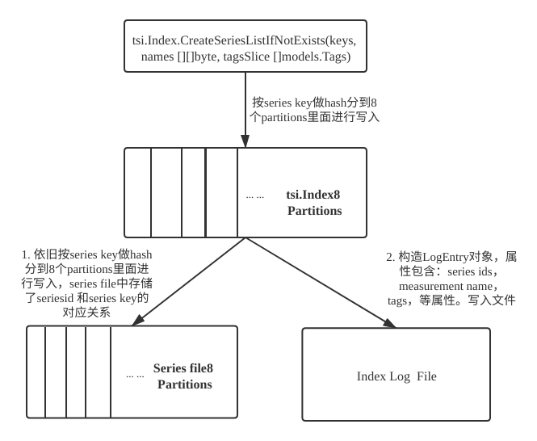

# tsi索引实现解析
tsi索引是Influxdb内部为了实现基于tag的多维查询，而设计的倒排索引。

## 举个例子直观说明？


数据最终在物理上是按series进行组织的，真正数据的存储其实只有field的value和时间戳，
只是数据是按列存的，一个series会组织存储一批的value和时间戳。


每个series内部会生成一个对应的series ID，倒排索引就是对每个measurement，tag建立和series ID的对应关系。

## tsi索引的写入流程？


数据写入时会调用tsi.Index.CreateSeriesListIfNotExists方法，这是tsi索引写入的入口，参数包含series key，measurement name，tags列表。

在一个shard的tsi索引内部是分8个partitions存储所有索引的，具体写入哪个partition是通过series key做hash对8取模得到。

在一个partition内部，写入流程为：
1. 先将series key写入数据库级别的全局series file中，返回series ids。 
2. 然后通过series ids，measurement name，tags等属性构造LogEntry对象，序列化写入Index的LogFile中。

series file为数据库全局所共有，记录series key和series id的对应关系。 
内部也是分8个partition，series key写入到哪个partition也是通过series key做hash对8取模得到。
每个partition内部是由一个个segment文件组成，每个segment文件最大256MB，超过生成新的segment文件。

数据写入series file的流程为：
1. 判断series key是否存在，存在则返回series ids。 否则
2. 生成新的series id，通过id，series key构造SeriesEntry对象，序列化追加写入到segment文件中。
3. 返回写入文件的offset，更新到内存SeriesIndex中。

series id生成的规则：id=seq, seq += 8。 partition的seq从1到8, 这样的好处是，通过id对8取模，可以立即定位到是那个partition。

Series Index内存结构：其维护了key-to-id 和 id-to-offset(series key在文件中的偏移量)。


## tsi索引是如何应用到查询里面的？
```sql
select * from m where tag1 = 'xxx';
```

在做类似像上面的查询时，内部会先通过tag1='xxx'去tsi索引中找到此tag值对应的所有series id，
再通过series ids去series file中找出对应的series keys，再通过series keys去tsm文件中或者内存中查找所有列的值。


## tsi文件格式是怎么样的？


