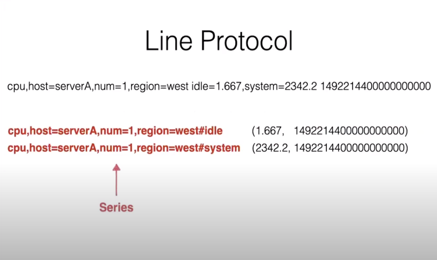
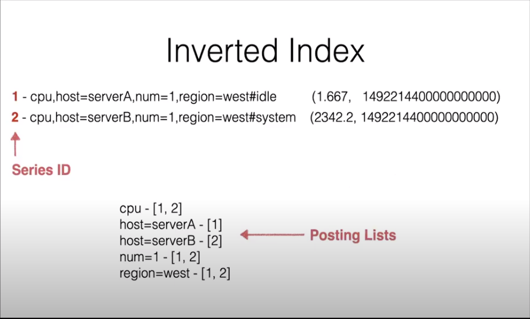

# tsi索引实现解析
tsi索引是Influxdb内部为了实现基于tag的多维查询，而设计的倒排索引。

## 举个例子直观说明？

数据最终在物理上是按series进行组织的，真正数据的存储其实只有field的value和时间戳，
只是数据是按列存的，一个series会组织存储一批的value和时间戳。

每个series内部会生成一个对应的series ID，倒排索引就是对每个measurement，tag建立和series ID的对应关系。

