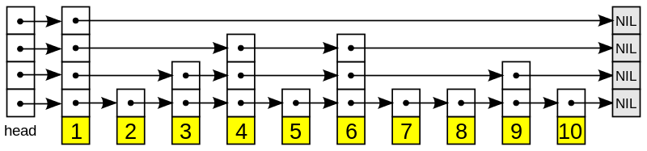
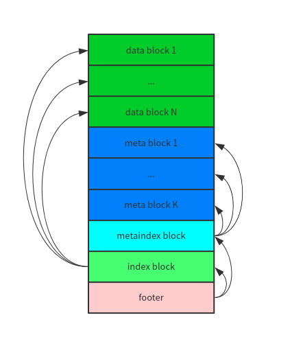
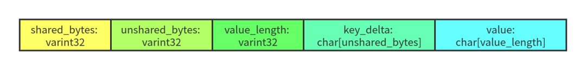
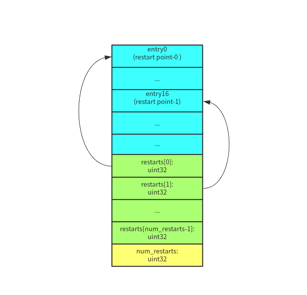

# LevelDB学习笔记

## 基本原理和整体架构是怎样的?
整体存储结构是采用LSM结构，如下图所示：


1. MemTable：内存数据结构，具体实现是 SkipList。 接受用户的读写请求，新的数据会先在这里写入。
2. Immutable MemTable：当 MemTable 的大小达到设定的阈值后，会被转换成 Immutable MemTable，只接受读操作，不再接受写操作，然后由后台线程 flush 到磁盘上 —— 这个过程称为 minor compaction。
3. Log：数据写入 MemTable 之前会先写日志，用于防止宕机导致 MemTable 的数据丢失。 一个日志文件对应到一个 MemTable。
4. SSTable：Sorted String Table。分为 level-0 到 level-n 多层，每一层包含多个 SSTable，文件内数据有序。除了 level-0 之外，每一层内部的 SSTable 的 key 范围都不相交。
5. Manifest：Manifest 文件中记录 SSTable 在不同 level 的信息，包括每一层由哪些 SSTable，每个 SSTable 的文件大小、最大 key、最小 key 等信息。
6. Current：重启时，LevelDB 会重新生成 Manifest，所以 Manifest 文件可能同时存在多个，Current 记录的是当前使用的 Manifest 文件名。
7. TableCache：TableCache 用于缓存 SSTable 的文件描述符、索引和 filter。
8. BlockCache：SSTable 的数据是被组织成一个个 block。 BlockCache 用于缓存这些 block（解压后）的数据。

## MemTable SkipList是如何实现的？
MemTable是通过SkipList数据结构存储数据的。 SkipList理论的插入和查询的时间复杂度都为Log(N)。


Skip list 是一种可以用于替代查找树的内存数据结构，其基本原理是在一个有序的链表之上增加一些索引，通过一个随机规则（保证一定概率）来“模拟”二分查找。

查询时可以通过选择最佳路径，快速找到查询的数据。 如需要查询(9)，则通过的线路为：经过的站点有 (1)、(4)、(6)、(9)。

LevelDB的SkipList支持无锁的一写多读，并且只支持查找和插入。LevelDB 通过维护一个写队列来保证同一时刻只有一个线程会写 MemTable。 

### SkipList如何实现无锁一写多读的？


## MemTable 的内部编码是怎么样的?


MemTable 中保存的数据是 key 和 value 编码成的一个字符串，由四个部分组成：

klength: 变长的 32 位整数（varint 的编码），表示 internal key 的长度。
internal key: 长度为 klength 的字符串。
vlength: 变长的 32 位整数，表示 value 的长度。
value: 长度为 vlength 的字符串。因为 value 没有参与排序，所以相关的讨论暂时可以忽略。

MemTable 的 KeyComparator 负责从 memkey 中提取出 internalkey，最终排序逻辑是使用 InternalKeyComparator 进行比较，排序规则如下：

1. 优先按照 user key 进行排序。
2. User key 相同的按照 seq 降序排序。
3. User key 和 seq 相同的按照 type 降序排序（逻辑上不会达到这一步，因为一个 LevelDB 的 sequence 是单调递增的）。

所以，在一个 MemTable 中，相同的 user key 的多个版本，新的排在前面，旧的排在后面。

## Log的格式编码是怎么样的?


如上图所示，LevelDB 的 log 文件内容被组织成多个 32 KB 的定长块（block）。每个 block 由 1~多个 record 组成（末尾可能会 padding）。
一个 record 由一个固定 7 字节的 header（checksum: uint32 + length: uint16 + type: uint8） 和实际数据（data: uint8[length]）组成。

如果 block 的末尾不足 7 字节（小于 header 的大小），则全部填 0x00，读取的时候会被忽略。

下面，我们将上层写入的数据称之为 user record，以区分 block 中的 record。
由于 block 是定长的，而 user record 是变长的，一个 user record 有可能被截断成多个 record，保存到一段连续的 block 中。
因此，在 header 中有一个 type 字段用来表示 record 的类型：
```
enum RecordType {
  // Zero is reserved for preallocated files
  kZeroType = 0,

  kFullType = 1,

  // For fragments
  kFirstType = 2,
  kMiddleType = 3,
  kLastType = 4
};
```
1. kFullType - 这是一个完整的 user record。
2. kFirstType -  这是 user record 的第一个 record。
3. kMiddleType - 这是 user record 中间的 record。如果写入的数据比较大，kMiddleType 的 record 可能有多个。
4. kLastType - 这是 user record 的最后一个 record。

## 为什么采用定长块的保存方式?
当日志文件发生数据损坏的时候，这种定长块的模式可以很简单地跳过有问题的块，而不会导致局部的错误影响到整个文件。


## SSTable内部结构？
SSTable 全称 Sorted String Table，顾名思义，里面的 key-value 都是有序保存的。除了两个 MemTable，LevelDB 中的大部分数据是以 SSTable 的形式保存在外存上。

SSTable 由 compaction 生成：
* Minor Compaction：一个 MemTable 直接 dump 成 level-0 的一个 SSTable。
* Major Compaction：多个 SSTable 进行合并、重整，生成 1～多个 SSTable。



### Footer
Footer 的大小为 48 字节，内容是一个 8 字节的 magic number 和两个 BlockHandle —— index handle 和 meta index handle，
index handle 指向 index block，meta index handle 指向 meta index block。

### Index Block
Index block 中的每条 key-value 指向一个 data block。value 比较简单直接，就是对应的 data block。
key 是一个大于等于当前 data block 中最大的 key 且小于下一个 block 中最小的 key，
这样做是为了减小 index block 的体积，这样index block 可以被尽可能 cache 在内存中。

### Meta Index Block
Meta index block 中的每条 key-value 指向一个 meta block。目前 LevelDB 中只有一个 meta block，保存的是这个 SSTable 中的 key 组成的 bloom filter。

### Data Block
Data block 是实际的 key-value 数据。  最简单的方式，block 里面只需要将一个个 key-value 有序保存。
但是为了节省空间，LevelDB 在 block 的内部实现了前缀压缩。

前缀压缩利用了 key 的有序性（前缀相同的有序 key 会聚集在一起）对 key 进行压缩，每个 key 与前一个 key 相同的前缀部分可以不用保存。
读取的时候再根据规则进行解码即可。

LevelDB 将 data block 的一个 key-value 称为一条 entry。每条 entry 的格式如下：


* shared_bytes：和前一个 key 相同的前缀长度。
* unshared_bytes：和前一个 key不同的后缀部分的长度。
* value_length：value 数据的长度。
* key_delta：和前一个 key不同的后缀部分。
* value：value 数据。

一个 data block 的数据格式如下：


* restarts：在 LevelDB 中，默认每 16 个 key 就会重新计算前缀压缩，重新开始计算前缀压缩到第一个 key 称之为重启点（restart point）。
    restarts 数组记录了这个 block 中所有重启点的 offset。
* num_restarts：是 restarts 数组的长度。

在 block 中查找一个 key:
1. 先在 restarts 数组的基础上进行二分查找，确定 restart point。
2. 从 restart point 开始遍历查找。


## LSM层级越多，写放大越大，那为什么还要设计那么多层级呢？


