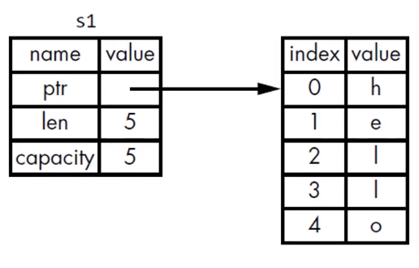
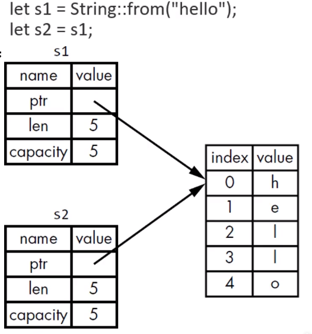
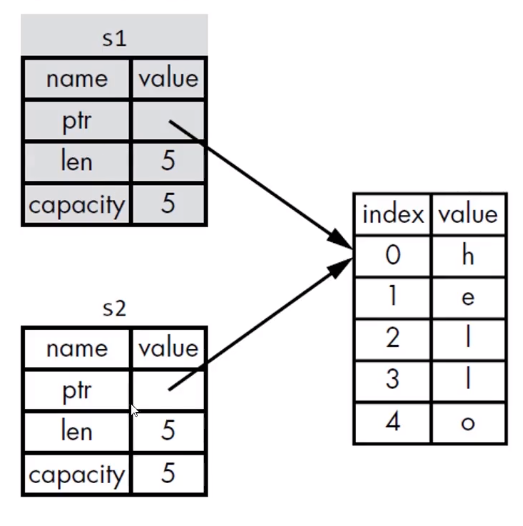
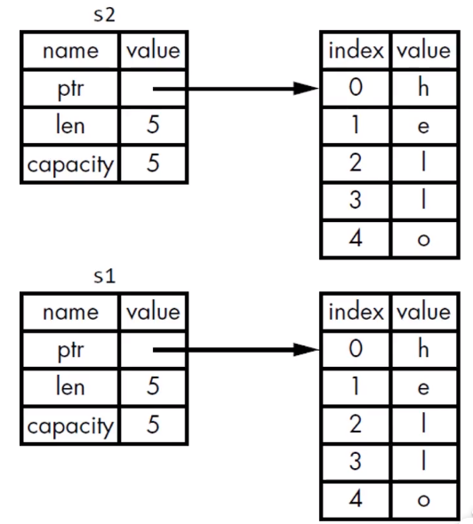
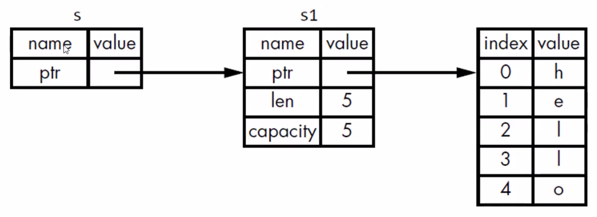
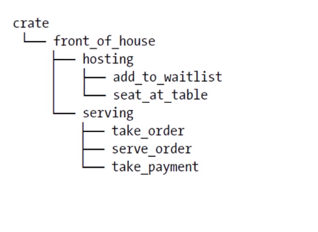
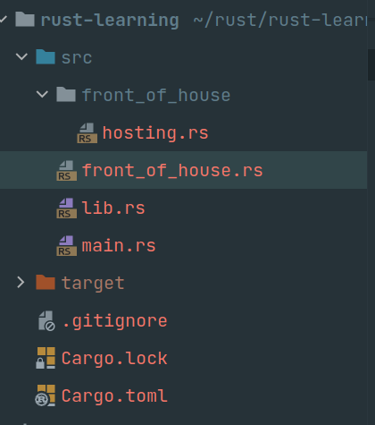

# Rust学习笔记

## 语法部分

### 变量与可变性
* 声明变量使用let关键字
* 默认情况下，变量是不可变的(Immutable)
* 声明变量时，在变量前面加上mut，就可以使变量可变

### 变量与常量
* 常量(constant)，常量在绑定值以后也是不可变的，但是与不可变变量有很多区别：
  - 不可以使用mut，常量永远都是不可变的
  - 声明常量使用const关键字，并且类型必须标注清楚
  - 常量可以在任意作用域内声明，包括全局作用域
  - 常量只可以绑定到常量表达式，无法绑定到函数的调用结果或只能在运行时才能计算出的值
* 在程序运行期间，常量在其声明的作用域内一直有效
* 命名规范：Rust里常量使用全大写字母，每个单词之间用下划线分开，例如：
  - MAX_POINTS
  - 例子：const MAX_POINTS:u32 = 100_OOO;

### 变量隐藏（shadow）
* 可以使用相同的名字声明新的变量，新的变量会shadow（隐藏）之前的同名变量
* shadow和把变量标记为mut是不一样的：
  - 如果不使用let关键字，重新给非mut的变量赋值会导致编译时错误
  - 而使用let声明的同名新变量，也是不可变的    
  - 使用let声明的同名新变量，它的类型可以与之前不同

示例：
```rust
fn main() {
    let mut guess = String::new();
    // do sth...

    // shadow
    let guess:u32 = guess.trim().parse().expect("Please type a number!"); // 编译器可以根据声明的u32类型，自动推断需要将字符串解析为u32类型
    // do sth...
}
```
这一特性在需要类型转换的场景特别有用，可以复用同一个变量名，这样就不用定义另外一个变量名，比如guess_int之类。

### 数据类型
* 标量和复合类型
* Rust是静态编译语言，在编译时必须知道所有变量的类型
  - 基于使用的值，编译器通常能够推断出它的具体类型
  - 但是如果可能的类型比较多（例如上面把String转为整数的parse方法），就必须添加类型的标注，否则编译会报错

#### 标量类型
* 一个标量类型代表一个单个的值
* Rust有四个主要的标量类型：
  - 整数类型（i8, i16, i32, i64, i128, isize, u8, u16, u32, u64, u128, usize）
  - 浮点类型（f32, f64）
  - 布尔类型（bool: true, false）
  - 字符类型（char, 字面值使用单引号）

isize 和 usize 类型：
* 其位数由程序运行的计算机的架构所决定，如64位计算机，那就是64位的
* 使用isize或usize的主要场景是对某种集合进行索引操作

#### 整数字面值
* 除了byte类型外，所有的数值字面值都允许使用类型后缀
  - 例如 57u8
* 如果不确定使用哪种类型，可以使用Rust相应的默认类型
* 整数的默认类型是i32
  - 总体上来说速度很快，即使在64位系统中

| Number literals | Example  |
|  ----  | ----  |
| Decimal      | 98_222 |
| Hex          | 0xff |
| Octal        | 0o77 |
| Binary       | 0b1111_0000 |
| Byte(u8 only)| b'A' |

#### 整数溢出
* 例如：u8的范围是0-255, 如果把一个u8变量的值设置为256,那么：
  - 调试模式下编译：Rust会检查整数溢出，如果发生溢出，程序在运行时就会panic
  - 发布模式下(--release)编译：Rust不会检查可能导致panic的整数溢出
    * 如果溢出发生：Rust会执行“环绕”操作：256变为0, 257变为1...
    * 但程序不会panic

#### 浮点类型
* Rust有两种基础的浮点类型，也就是包含小数部分的类型
  - f32, 32位  单精度
  - f64, 64位  双精度
* Rust的浮点类型使用了IEEE-754标准来表述
* f64是默认的类型，因为在现代CPU上f64和f32的速度差不多，而且精度更高

#### 字符类型
* Rust中char类型被用来描述语言中最基础的单个字符
* 字符类型的字面值使用单引号
* 占用4字节大小
* 是Unicode标量值，可以表示比ASCII多得多的字符内容：拼音、中日韩文、零长度空白字符、emoji表情等
  - U+0000 到 U+D7FF
  - U+E000 到 U+10FFFF

示例：
```rust
fn main() {
    let x = 'z';
    let y: char = '∑';
    let z = '李️';
}
```    

#### 复合类型
* 复合类型可以将多个值放在一个类型里
* Rust提供了两种基础的复合类型：元组(Tuple)、数组

#### Tuple
* Tuple可以将多个类型的多个值放在一个类型里
* Tuple的长度是固定的，一旦声明就无法改变

示例：
```rust
fn main() {
    // 创建Tuple
    // 在小括号里，将值用逗号分开
    // Tuple中的每个位置都对应一个类型，Tuple中各元素的类型不必相同
    let tup: (i32, f64, u8) = (500, 6.4, 1);
    
    // 获取Tuple的元素值
    // 可以使用模式匹配来解构（destructure）一个Tuple来获取元素的值
    let (x, y, z) = tup;
    println!("{}, {}, {}", x, y, z);
    
    // 访问Tuple的元素
    // 在Tuple变量使用点标记法，后接元素的索引号
    println!("{}, {}, {}", tup.0, tup.1, tup.2);
}
```

#### 数组
* 数组也可以将多个值放在一个类型里
* 数组中每个元素的类型必须相同
* 数组的长度也是固定的

示例：
```rust
fn main() {
    // 声明一个数组
    // 在中括号里，各值用逗号分开
    let a = [1, 2, 3, 4, 5];
    let months = [
        "January",
        "February",
        "March",
        "April",
        "May",
        "June",
        "July",
        "August",
        "September",
        "October",
        "November",
        "December",
    ];
}
```

数组的用处：
* 如果想让数据存放在stack(栈)上而不是heap(堆)上，或者想保证有固定数量的元素，这时使用数组更有好处
* 数组没有Vector灵活
  - Vector和数组类似，它由标准库提供
  - Vector的长度可以改变
  - 如果不确定应该用数组还是Vector，那么估计应该使用Vector

数组的类型：
* 数组的类型以这周形式表示：[类型; 长度]
  - 例如： let a:[i32; 5] = [1, 2, 3, 4, 5];

示例：
```rust
fn main() {
    // 指定类型和长度
    let a:[i32; 5] = [1, 2, 3, 4, 5];
    
    // 另一种声明数组的方法
    // 如果数组的每个元素值都相同，那么可以在：
    // 在中括号里指定初始值，然后是一个“;”，最后是数组的长度
    let a = [3; 5];
    // 等价于
    let a = [3, 3, 3, 3, 3];
    
    // 访问数组的元素
    // 数组是Stack上分配的单个块内存
    // 可以使用索引来访问数组的元素
    let first = a[0];
    let second = a[1];
    
    // 如果访问的索引超出了数组的范围，那么
    // 编译会通过(不是绝对，会做最简单的检查)，运行会报错(runtime时会panic)
    // Rust不会允许其继续访问相应地址的内存
    let last = a[5] // 报错，简单的编译器检查不通过
    
    let index = [6, 7];
    let last = a[index[1]]; // 虽然是非法的，但是编译会通过，运行时将panic
}
```

### 函数
* 声明函数使用fn关键字
* 依照惯例，针对函数和变量名，Rust使用snake case命名规范
  - 所有的字母都是小写，单词之间使用下划线分开
* 在函数签名里，必须声明每个参数的类型
* 函数体由一系列语句组成，可选的由一个表达式结束(相当于返回这个表达式的值)
* Rust是一个基于表达式的语言
* 语句是执行一些动作的指令
* 表达式会计算产生一个值(表达式本质可以理解就是一个值)
* 函数的定义也是语句
* 语句不返回值，所以不可以使用let将一个语句赋给一个变量
* 在-> 符号后边声明函数返回值的类型，但是不可以为返回值命名
* 在Rust里面，返回值就是函数体里面最后一个表达式的值
* 若想提前返回，需使用return关键字，并指定一个值
  - 大多数函数都是默认使用最后一个表达式作为返回值

示例：
```rust
// 整个函数的定义是一个语句
fn main() {
    // 这是一个语句
    let y = 6; // 6是一个字面值，所有字面值都是表达式
    let y = 5 + 6; // 5+6也是一个表达式，表达式都对应一个值。 
    
    // 表达式可以作为语句的一部分，调用函数也是一个表达式，调用宏也是表达式，比如println!，一个块也是一个表达式
    let y = {
      let x = 1;
      x + 3 // x + 3,是一个表达式，也是这个块的值，因为是最后一个表达式，因此y的值就是好4
    };
  
    // let x = (let z = 6); // 编译报错，不能够将statement(语句)赋值给变量，期望是一个表达式
    
    let x = plus_five(6); // x == 11
    
}

fn plus_five(x: i32) -> i32 {
    x + 5 // 最后的表达式作为函数的返回值
}
```

### 控制流(if else)
* if表达式允许根据条件来执行不同的代码分支
  - 这个条件必须是bool类型
* if表达式中，与条件相关联的代码块叫做分支(arm)  
* 可选的，可以在后面加上一个else表达式
* 但如果使用了多于一个的else if，那么最好是使用match来重构代码

示例：
```rust
fn main() {
    let number = 6;
    
    // if else if else 的判断顺序是从上往下依次判断，谁在前面就执行对应的逻辑
    if number % 4 == 0 {
      println!("number is divisible by 4");
    } else if number % 3 == 0 {
      println!("number is divisible by 3"); // 执行进入这个块
    } else if number % 2 == 0 {
      println!("number is divisible by 2");
    } else {
      println!("number is not divisible by 4, 3 or 2");
    }
    // match 重构
    match number {
      num if num % 4 == 0 => println!("number is divisible by 4"),
      num if num % 3 == 0 => println!("number is divisible by 3"),
      num if num % 2 == 0 => println!("number is divisible by 2"),
      _ => println!("number is not divisible by 4, 3 or 2"),
    }
}
```

在let语句中使用if：
* 因为if是一个表达式，所以可以将它放在let语句中等号的右边

示例：
```rust
fn main() {
    let cond = true;
    
    let number = if cond { 5 } else { 6 };
    
    println!("The value of number is: {}", number);
}
```

### 控制流(循环)
* Rust提供了3种循环：loop，while和for
* loop关键字告诉Rust反复执行一块代码，直到你喊停
* 可以在loop循环中使用break关键字来告诉程序何时停止循环
* while条件循环，是每次执行循环体之前都判断一次条件
* for循环更适合集合的遍历，更简洁紧凑，它可以针对集合中的每个元素来执行一些代码
* 由于使用for循环的安全、简洁性，所以它在Rust里面用的最多

示例：
```rust
fn main() {
    let mut counter = 0;
    let result = loop {
        counter += 1;
        if counter == 10 {
          break counter * 2
        }
    };
    println!("The result is: {}", result);

    let mut number = 3;
    while number != 0 {
      println!("{}!", number);
      number -= 1;
    }
    println!("LIFTOFF!!!");

    let a = [10, 20, 30, 40, 50];
    for element in a.iter() {
      println!("the value is: {}", element);
    }
}
```

for 配合Range使用：
* 标准库提供
* 指定一个开始数字和一个结束数字，Range 可以生成它们之间的数字(不包含结束)
* rev 方法可以反转Range

示例：
```rust
fn main() {
    for number in (1..4).rev() {
      println!("{}!", number);
    }
    println!("LIFTOFF!");
}
```

### 所有权
所有权是Rust独特的特性，它让Rust无需GC就可以保证内存安全。

#### 什么是所有权
* Rust的核心特性就是所有权
* 所有程序在运行时都必须管理它们使用计算机内存的方式
  - 有些语言有垃圾收集机制，在程序运行时，它们会不断的寻找不再使用的内存
  - 在其他语言中，程序员必须显示地分配和释放内存
  
* Rust采用了第三种方式：
  - 内存是通过一个所有权系统来管理的，其中包含一组编译器在编译时检查的规则
  - 当程序运行时，所有权特性不会减慢程序的运行速度。因为Rust把内存管理的工作都提前到了编译时

#### Stack vs Heap(栈内存 vs 堆内存)
* 在像Rust这样的系统级编程语言里，一个值实在stack还是在heap上对语言的行为和你为什么要做某些决定是有重大的影响的
* 在你的代码运行的时候，stack和heap都是你可用的内存，但它们的结构很不相同
* Stack按值的接收顺序来存储，按相反的顺序将它们移除（后进先出，LIFO）
  - 添加数据叫做压入栈
  - 移除数据叫做弹出栈
* 所有存储在Stack上的数据必须拥有已知的固定的大小
  - 编译时大小未知的数据或运行时大小可能发生变化的数据必须存放在heap上
* Heap内存组织性差一些：
  - 当你把数据放入heap时，你会请求一定数量的空间
  - 操作系统在heap里找到一块足够大的空间，把它标记为在用，并返回一个指针，也就是这个空间的地址
  - 这个过程叫做在heap上进行分配，有时候仅仅称为“分配”
* 把值压到stack上不叫分配（因为不需要分配，在stack内存上挨着放就可以了）
* 因为指针是已知固定大小的，可以把指针存放在stack上
  - 但如果想要实际数据，你必须使用指针来定位
* 把数据压到stack上要比在heap上分配快得多：
  - 因为操作系统不需要寻找用来存储新数据的空间，那个位置永远都在stack的顶端
* 在heap上分配空间需要做更多的工作：
  - 操作系统首先需要找到一个足够大的空间来存放数据，然后要做好记录方便下次分配
* 访问heap中的数据要比访问stack中的数据慢，因为需要通过指针才能找到heap中的数据
  - 对于现代的处理器来说，由于缓存的缘故，如果指令在内存中跳转的次数越少，那么速度就越快
* 如果数据存储的距离比较近，那么处理器的处理速度就会更快一些(stack上)
* 如果哦数据之间的距离比较远，那么处理速度就会慢一些(heap上)
  - 在heap上分配大量空间也是需要时间的

##### 函数调用
* 当你的代码调用函数时，值倍传入到函数(也包括指向heap的指针)。函数本地的变量被压到stack上。当函数结束后，这些值会从stack上弹出

##### 所有权存在的原因
* 所有权解决的问题：
  - 跟踪代码的哪些部分正在使用heap的哪些数据
  - 最小化heap上的重复数据量
  - 清理heap上未使用的数据以避免空间不足
* 一旦你懂了所有权，那么就不需要经常去想stack或heap了
* 但是知道管理heap数据是所有权存在的原因，这有助于解释它为什么这样工作

### 所有权规则
* 每个值都有一个变量，这个变量是该值的所有者
* 每个值同时只能有一个所有者
* 当所有者超出作用域(scope)时，该值将被删除

#### 变量作用域
* Scope就是程序中一个项目的有效范围

#### String类型
* String比那些基础标量数据类型更复杂(String类型是存储在heap上的，而基础标量类型存储在stack上)
* 字符串字面值：程序里手写的那些字符串值。它们是不可变的
* Rust还有第二种字符串类型：String
  - 在heap上分配。能够存储在编译时未知数量的文本
  
##### 创建String类型的值
* 可以使用from函数从字符串字面值创建出String类型
* let s = String::from("hello);
  - "::"表示from是String命名空间下的函数
* 这类字符串是可以被修改的

示例：
```rust
fn main() {
    let mut s = String::from("Hello");
    s.push_str(", World");

    println!("{}", s);
}
```

* 为什么String类型的值可以修改，而字符串字面值却不能修改？
  - 因为它们处理内存的方式不同

### 内存与分配
* 字符串字面值，在编译时就知道它的内容了，其文本内容直接被硬编码到最终可执行文件里
  - 速度快、高效。是因为其不可变性
* String类型，为了支持可变性，需要在heap上分配内存来保存编译时未知的文本内容：
  - 操作系统必须在运行时来请求内存
    * 这步通过调用String::from来实现
  - 当用完String之后，需要使用某种方式将内存返回给操作系统
    * 这步，在拥有GC的语言中，GC会跟踪并清理不再使用的内存
    * 没有GC，就需要我们去识别内存何时不再使用，并调用嗯代码将它返回
      - 如果忘了，那就会内存泄漏，造成内存浪费
      - 如果提前做了，变量就会非法
      - 如果做了两次，也是Bug。必须一次分配对应一次释放

#### Rust对内存的处理方式
* Rust采用了不同的方式：对于某个值来说，当拥有它的变量走出作用范围时，内存会立即自动的交还给操作系统。
* drop函数(当变量走出作用域，Rust会自动调用这个函数)

#### 变量和数据交互的方式：移动(move)
* 多个变量可以与同一个数据使用一种独特的方式来交互
```rust
fn main() {
    let x = 5;
    let y = x;  // 简单类型的值，会被复制再复制给y
}
```
* 整数是已知且固定大小的简单的值，这两个5会被压到stack中

```rust
fn main() {
    let s1 = String::from("hello");
    let s2 = s1;
}
```

* 情况和前面的例子不同


* 一个String由3部分组成：
  - 一个指向存放字符串内容的指针
  - 一个长度
  - 一个容量
* 上面这些东西放在stack上
* 存放字符串内容的部分在heap上
* 长度len，就是字符串内容所需的字节数
* 容量capacity是指String从操作系统总共获得内存的总字节数


* 当把s1赋给s2, String的数据会被复制一份：
  - 在stack上复制了一份指针、长度和容量
  - 并没有复制指针所指向的heap上的数据
* 当变量离开作用域时，Rust会自动调用drop函数，并将变量使用的heap内存释放  
* 当s1,s2离开作用域时，它们都会尝试释放相同的内存：
  - 造成二次释放（double free）bug

* 为了保证内存安全：
  - Rust没有尝试复制被分配的内存
  - Rust让s1失效
    * 当s1离开作用域的时候，Rust不需要释放任何东西
* 当s2创建以后 再使用s1的效果：
```rust
let mut s = String::from("Hello");
  |         ----- move occurs because `s` has type `String`, which does not implement the `Copy` trait
3 |     let s2 = s;
  |              - value moved here
4 | 
5 |     println!("{}", s);
  |                    ^ value borrowed here after move
```

* 浅拷贝（shallow copy）
* 深拷贝（deep copy）
* 你也许会将复制指针、长度、容量视为浅拷贝，但由于Rust让s1失效了，所以我们用一个新的术语：移动（move）


灰色部分代表失效，那么现在s2是有效的， 那么只有s2离开作用域会去释放内存空间，所以就不会出现二次释放内存的Bug了。
这就体现了Rust的安全性。

* 这隐含了一个设计原则：Rust不会自动创建数据的深拷贝
  - 就运行时性能而言，任何自动赋值的操作都是廉价的

##### 克隆(Clone)
* 如果真想对heap上的String数据进行深度拷贝，而不仅仅是stack上的数据，可以使用clone方法

```rust
fn main() {
    let s1 = String::from("hello");
    let s2 = s.clone();

    println!("{}, {}", s1, s2); // 这样就不会报错，s1并不会发生转移    
}
```


clone相当于对stack上的数据和heap上的数据都进行了完整的拷贝，此操作相对比较耗时。


#### Stack上的数据：复制
* Stack上的数据不需要clone，直接复制就可以了。 示例：
```rust
fn main() {
    let x = 5;
    let y = x;
    println!("{}, {}", x, y);   // 和String的例子不同，此时并不会报错。 x，y都是有效的
}    
```
x赋值给y后，依然是有效的，因为x是整数类型(简单类型)，在编译时就确定了自己的大小，并且能够将自己的数据完整的存储在Stack中，
对于这些值的复制操作，都是非常快速的，因此在创建变量y后，没有任何理由去阻止保持x有效。 换言之，深度拷贝和浅拷贝是没有任何区别的，
因此不用考虑上面的移动发生变量不可用的问题。
* Copy trait, 可以用于像整数这样完全存放在stack上面的类型
* 如果一个类型实现了Copy这个trait，那么旧的变量在赋值后仍然可用
* 如果一个类型或者该类型的一部分实现了Drop trait，那么Rust不允许让它再去实现Copy trait了

#### 一些拥有Copy trait的类型
* 任何简单标量的组合类型都可以Copy的
* 任何需要分配内存或某种资源的都不是Copy的
* 一些拥有Copy trait的类型：
  - 所有的整数类型，如u32
  - bool
  - char
  - 所有浮点类型，如f64
  - Tuple(元祖)，如果其所有的字段都是Copy的
    * (i32, i32) 是
    * (i32, String) 不是

### 所有权与函数
* 在语义上，将值传递给函数和把值赋给变量是类似的：
  - 将值传递给函数将发生“移动”或“复制”
```rust
fn main() {
    let s = String::from("Hello World");
    // s传入函数，即s移动到此函数里面，s即不再有效
    take_ownership(s);

    let x = 5;
    // x也传入函数，x是i32类型，此类型实现了Copy trait，实际上往函数里面传的是x的副本，因此x在传递后仍然是有效的
    makes_copy(x);

    println!("x: {}", x); // 此行以后，x就不再有效
}

fn take_ownership(s: String) {
    println!("{}", s);  // 此行之后，s离开了作用域，此时rust会自动调用其Drop函数，其所占的内存也就被释放了
}

fn makes_copy(n: i32) {
    println!("{}", n);  // 此行之后，n离开了作用域，而对于简单类型，不会有什么特别的事情发生
}

```

#### 返回值与作用域
* 函数在返回值的过程中同样也会发生所有权的转移
```rust
fn main() {
    let s1 = gives_ownership(); // 返回值移动给s1

    let s2 = String::from("hello"); // 声明s2变量

    let s3 = takes_and_gives_back(s2); // 将s2移动到函数里面，并且s3再次获得返回值所有权

    // 此行之后， s1, s3离开了作用域，其会被销毁
}

fn gives_ownership() -> String {
    let s = String::from("hello"); // 声明一个String变量
    s   // 作为返回值移动到调用它的函数里面
}

fn takes_and_gives_back(s: String) -> String {
    s // 即将参数s作为返回值又移动给了调用者。 
}
```

* 一个变量的所有权总是遵循同样的模式：
  - 把一个值赋给其他变量时就会发生移动
  - 当一个包含heap数据的变量离开作用域时，它的值就会被drop函数清理，除非数据的所有权移动到另外一个变量上了

#### 如何让函数使用某个值，但不获得其所有权？
* Rust有一个特性叫做“引用(Reference)”

### 引用与借用
```rust
fn main() {
    let s = String::from("Hello");
    let len = calculate_len(&s);  // &符号，代表传递的是s的引用

    println!("The length of '{}' is {} ", s, len);
}

fn calculate_len(s: &String) -> usize { // 参数带有&符号，表示是参数是String类型的引用
    s.len()  // s只是一个引用，并不拥有其所指向的值的所有权，因此其离开作用域后，不会销毁其所指向的值
}
```

* 参数的类型是&String而不是String
* &符号就表示引用：允许引用某些值而不取得其所有权


上图中，s代表s1的指针，s指向了s1, s1内部又包含一个指针，它指向了存在heap上的真实数据内容。

#### 借用
* 我们把引用作为函数参数这个行为叫做借用
* 是否可以修改借用的东西？
  - 不行
```rust
fn main() {
    let s = String::from("Hello");
    let len = calculate_len(&s);

    println!("The length of '{}' is {} ", s, len);
}

fn calculate_len(s: &String) -> usize {
    s.push_str(", world");  // 报错：error[E0596]: cannot borrow `*s` as mutable, as it is behind a `&` reference
    s.len()
}
```
* 和变量一样，引用默认也是不可变的

#### 可变引用
```rust
fn main() {
    let mut s = String::from("Hello");  // 声明可变变量
    let len = calculate_len(&mut s); // 引用也需要是可变的

    println!("The length of '{}' is {} ", s, len);
}

fn calculate_len(s: &mut String) -> usize {
    s.push_str(", world");
    s.len()
}
```
* 可变引用有一个重要的限制：在特定作用域内，对某一块数据，只能有一个可变引用
  - 这样做的好处是可在编译时防止数据竞争
```rust
fn main() {
    let mut s = String::from("Hello");
    let s1 = &mut s;
    let s2 = &mut s;  // 报错：error[E0499]: cannot borrow `s` as mutable more than once at a time

    println!("The length of '{}' is {} ", s1, s2);
}
```

* 在以下三种行为会发生数据竞争：
  - 两个或多个指针同时访问同一个数据
  - 至少有一个指针用于写入数据
  - 没有使用任何机制来同步对数据的访问

* 可以通过创建新的作用域，来允许非同时的创建多个可变引用
```rust
fn main() {
    let mut s = String::from("Hello");
    {   
        let s1 = &mut s;
    }
    
    let s2 = &mut s;
}
```

* 另外一个限制：不可以同时拥有一个可变引用和一个不可变引用(因为如果允许的话，可变引用把值修改了，那么不可变引用就失效了)
* 多个不可变引用是可以的
```rust
fn main() {
    let mut s = String::from("Hello");
    let r1 = &s;
    let r2 = &s;
    let s1 = &mut s;  // 报错：error[E0502]: cannot borrow `s` as mutable because it is also borrowed as immutable
    println!("{}, {}, {}", r1, r2, s1);
}
```

#### 悬空引用 Dangling References
* 悬空指针(Dangling Pointer): 一个指针引用了内存中的某个地址，而这块内存可能已经释放并分配给其它人使用了
* 在Rust里，编译器可保证引用永远都不会是悬空引用：
  - 如果你引用了某些数据，编译器将保证在引用离开作用域之前数据不会离开作用域
```rust
fn main() {
    let r = dangle();
}

fn dangle() -> &String { // error[E0106]: missing lifetime specifier
    let s = String::from("hello");
    &s  // 此处会出现悬空引用，但是编译时，无法编译通过
}
```

#### 引用的规则
* 在任何给定的时刻，只能满足下列条件之一：
  - 一个可变的引用
  - 任意数量的不可变的引用
* 引用必须一直有效


### 切片
* 除了上一章的引用，Rust的另外一种不持有所有权的数据类型：切片(slice)
* 一道题，编写一个函数：
  - 它接收一个字符串作为参数
  - 返回它在这个字符串中找到的第一个单词
  - 如果函数没有找到任何空格，那么整个字符串就被返回

尝试解答：
```rust
fn main() {
    let mut s = String::from("Hello world");
    let word_index = first_word(&s);
    
    // s.clear();   
    println!("{}", word_index);
}

fn first_word(s: &String) -> usize {
    let bytes = s.as_bytes();

    for (i, &item) in bytes.iter().enumerate() {
        if item == b' ' {
            return i;
        }
    }
    s.len()
}
```
上面这种实现方式的问题在于：需要确保word_index的有效性，保证word_index和变量s之间的同步性(比如如果调用了clear方法，那么word_index就失效了)。
而这类工作非常繁琐，并且容易出错。 Rust为这类问题提供了解决方案：字符串切片

#### 字符串切片
* 字符串切片是指向字符串中一部分内容的引用
```rust
fn main() {
    let s = String::from("Hello world");
    let hello = &s[0..5];  //简写： &s[..5]
    let world = &s[6..11];  //简写： &s[6..]
    // let whole = &s[..]  // 整个切片的简写
}
```
* 形式：[开始索引..结束索引]
  - 开始索引是切片起始位置的索引值
  - 结束索引是切片终止位置的下一个索引值

* 注意事项
  - 字符串切片的范围索引必须发生在有效的UTF-8字符边界内
  - 如果尝试从一个多字节的字符中创建字符串切片，程序会报错并退出

* 使用字符串切片重写例子：
```rust
fn main() {
    let mut s = String::from("Hello world");
    let word = first_word(&s);
    // s.clear(); // error[E0502]: cannot borrow `s` as mutable because it is also borrowed as immutable
    println!("{}", word);
}

fn first_word(s: &String) -> &str {
    let bytes = s.as_bytes();

    for (i, &item) in bytes.iter().enumerate() {
        if item == b' ' {
            return &s[..i];
        }
    }
    &s[..]
}

```

#### 字符串字面值是切片
* 字符串字面值被直接存储在二进制程序中
* let s = "Hello world";
* 变量s的类型是&str, 它是一个指向二进制程序特定位置的切片
  - &str是不可变引用，所以字符串字面值也是不可变的

#### 将字符串切片作为参数传递
* fn first_word(s: &String) -> &str {
* 有经验的Rust开发者会采用&str作为参数类型，因为这样就可以同时接收String和&str类型的参数了
* fn first_word(s: &str) -> &str {
  - 使用字符串切片，直接调用该函数
  - 使用String，可以创建一个完整的String切片来调用该函数
* 定义函数时，使用字符串切片来代替字符串引用会使我们的API更加通用，且不会损失任何功能
```rust
fn main() {
    let s = String::from("Hello world");
    let word = first_word(&s[..]);
    println!("{}", word);

    let s2 = "hello world";
    let word = first_word(s2);

    println!("{}", word);
}

fn first_word(s: &str) -> &str {
    let bytes = s.as_bytes();

    for (i, &item) in bytes.iter().enumerate() {
        if item == b' ' {
            return &s[..i];
        }
    }
    &s[..]
}

```

#### 其他类型的切片
```rust
fn main() {
  let a = [1, 2, 3, 4, 5];
  let slice = &a[1..3]; // &[i32] 类型

}
```
切片的内部包含：一个指针(指向其实元素的位置)和一个切片的长度，两个字段

### 定义并实例化struct
#### 什么是struct
* struct,结构体
  - 自定义的数据类型
  - 为相关联的值命名，打包有意义的组合
  
#### 定义struct
* 使用struct关键字，并为整个struct命名
* 在花括号内，为所有字段(Field)定义名称和类型
* 例如：
```rust
struct User {
  username: String,
  email: String,
  sign_in_count: u64,
  active: bool,
}
```

#### 实例化struct
* 想要使用struct，需要创建struct的实例：
  - 为每个字段指定具体值
  - 无需按声明的顺序进行指定
* 例子：
```rust
fn main() {
  println!("Hello world");

  let mut user1 = User {
    email: String::from("abc@qq.com"),
    username: String::from("nange"),
    active: true,
    sign_in_count: 556,
  };
  user1.email = String::from("another@qq.com");
}

struct User {
  username: String,
  email: String,
  sign_in_count: u64,
  active: bool,
}
```

注意: 一旦struct的实例是可变的，那么实例中所有的字段都是可变的。 不允许部分可变部分不可变。

#### struct作为函数的返回值
* 例子：
```rust
fn main() {
    let mut user1 = build_user(String::from("123@qq.com"), String::from("nange"));
    user1.email = String::from("another@qq.com");
    println!("email: {}", user1.email);
}

struct User {
    username: String,
    email: String,
    sign_in_count: u64,
    active: bool,
}

fn build_user(email: String, username: String) -> User {
    User {
        username: username,
        email: email,
        active: true,
        sign_in_count: 1,
    }
}
```

#### 字段初始化简写
* 当字段名与字段值对应的变量名相同时，就可以使用字段初始化简写方式：
* 示例：
```rust
fn build_user(email: String, username: String) -> User {
    User {
        username,
        email,
        active: true,
        sign_in_count: 1,
    }
}
```

#### struct更新语法
* 当你想基于某个struct实例来创建一个新实例的时候，可以使用struct更新语法：
* 正常写法：
```rust
fn main() {
  let user2 = User {
      email: String::from("another@qq.com"),
      username: String::from("another"),
      active: user1.active,
      sign_in_count: user1.sign_in_count,
  };
}
```
* 更新语法写法：
```rust
fn main() {
  let user2 = User {
      email: String::from("another@qq.com"),
      username: String::from("another"),
      ..user1 // 表示还没有指定的字段的值都使用user1相同的值
  };
}
```

#### Tuple struct
* 可以定义类似tuple的struct，叫做tuple struct
  - Tuple struct整体有个名字，但里面的元素没有名字
  - 适用：想给整个tuple起名，并让它不同于其他tuple，而且又不需要给每个元素起名
* 定义tuple struct：使用struct关键字，后边是名字，以及里面元素的类型
* 例子：
```rust
fn main() {
    let black = Color(0, 0, 0);
    let origin = Point(0, 0, 0);
    println!("black item0: {}, origin item0: {}", black.0, origin.0);
}

struct Color(i32, i32, i32);
struct Point(i32, i32, i32);
```
* black和origin是不同的类型，是不同tuple struct的实例

#### Unit-Like Struct（没有任何字段）
* 可以定义没有任何字段的struct，叫做Unit-Like struct(因为与(),单元类型类似)
* 适用于需要在某个类型上实现某个trait，但是在里面又没有想要存储的数据

#### struct数据的所有权
* 示例：
```rust
struct User {
    username: String,
    email: String,
    sign_in_count: u64,
    active: bool,
}
```
* 这里的字段使用了String而不是&str：
  - 该struct实例拥有所有数据的所有权
  - 只要struct实例是有效的，那么里面的字段数据也是有效的
* struct里也可以存放给引用，但这需要使用生命周期(以后讲)
  - 生命周期保证只要struct实例是有效的，那么里面的引用也是有效的
  - 如果struct里面存储引用，而不使用生命周期，就会报错(示例)
```rust
struct User {
    username: &str,  // error[E0106]: missing lifetime specifier
    email: &str,   // error[E0106]: missing lifetime specifier
    sign_in_count: u64,
    active: bool,
}

fn main() {
    let user1 = User {
        username: "nange",
        email: "123@qq.com",
        sign_in_count: 1,
        active: true,
    };
}
```

#### struct的例子
```rust
#[derive(Debug)]
struct Rectangle {
    width: u32,
    length: u32,
}

fn main() {
    let rect = Rectangle {
        width: 30,
        length: 50,
    };
    println!("{}", area(&rect));

    // 要能被println!()方法打印，需要实现Display trait，简单类型，默认已经实现Display，但是复杂类型则没有，因此直接打印会报错
    // println!("{}", rect)

    // 使用:?，表示打印调试(Debug)信息，Rust本身包含了打印调试信息的功能，但是必须为结构体显示的选择这一功能，也就是加上#[derive(Debug)]
    println!("{:?}", rect);
    println!("{:#?}", rect); // 打印更易读的调试信息
}

fn area(rect: &Rectangle) -> u32 {
    rect.width * rect.length
}
```

* std::fmt::Display
* std::fmt::Debug
* #[derive(Debug)]
* {:?}
* {:#?}

### struct的方法
* 方法和函数类似：fn关键字、名称、参数、返回值
* 方法与函数不同之处：
  - 方法是在struct（或enum、trait对象）的上下文中定义
  - 第一个参数是self，表示方法被调用的struct实例

#### 定义方法
* 示例：
```rust
#[derive(Debug)]
struct Rectangle {
    width: u32,
    length: u32,
}

impl Rectangle {
    // 此块就是struct的上下文

    // 此处是获取了一个借用，不持有所有权，并且是不可变借用
    // 也可以获得所有权和可变借用，则可以写为：fn area(self) -> u32; fn area(&mut self) -> u32;(如果是可变的，那么rect也需要改为mut)
    fn area(&self) -> u32 {
        self.width * self.length
    }
}

fn main() {
    let rect = Rectangle {
        width: 30,
        length: 50,
    };
    println!("{}", rect.area());

    println!("{:?}", rect);
}
```

* 在impl块里定义方法
* 方法的第一个参数可以是&self， 也可以获得其所有权 或 可变借用。 和其他参数一样
* 使用方法后，就避免了，每次都要self传进去。 
* 更好的代码组织

#### 方法调用的运算符
* C/C++： object->something() 和 (*object).something()，用于区分是指针调用还是对象直接调用，
  使用(*object)相当于对对象解引用，然后调用方法。这两者是等价的。
* Rust没有 -> 运算符
* Rust会自动引用或解引用
  - 在调用方法时就会自动发生这种行为
* 在调用方法时，Rust 会根据清空自动添加&、&mut或*，以便object可以匹配方法的签名  
* 下面两行代码效果相同：方法签名为 fn distance(&self, &p2)
  - p1.distance(&p2);
  - (&p1).distance(&p2);

#### 方法参数
* 方法可以有多个参数
* 示例：
```rust
#[derive(Debug)]
struct Rectangle {
    width: u32,
    length: u32,
}

impl Rectangle {
    fn area(&self) -> u32 {
        self.width * self.length
    }

    fn can_hold(&self, other: &Rectangle) -> bool {
        self.width > other.width && self.length > other.length
    }
}

fn main() {
    let rect1 = Rectangle {
        width: 30,
        length: 50,
    };
    let rect2 = Rectangle {
        width: 10,
        length: 40,
    };
    let rect3 = Rectangle {
        width: 35,
        length: 50,
    };

    println!("{}", rect1.can_hold(&rect2));
    println!("{}", rect1.can_hold(&rect3));
}

```

#### 关联函数
* 可以在impl块里定义不把self作为第一个参数的函数，它们叫关联函数(不是方法)
  - 例如：String::from()
* 关联函数通常用于构造器(示例)
```rust
#[derive(Debug)]
struct Rectangle {
    width: u32,
    length: u32,
}

impl Rectangle {
    fn area(&self) -> u32 {
        self.width * self.length
    }

    fn can_hold(&self, other: &Rectangle) -> bool {
        self.width > other.width && self.length > other.length
    }

    fn square(size: u32) -> Rectangle {
        Rectangle {
            width: size,
            length: size,
        }
    }
}

fn main() {
    let s = Rectangle::square(10); // 相当于这个函数位于Rectangle这个类型的命名空间里面
    let rect1 = Rectangle {
        width: 30,
        length: 50,
    };
    let rect2 = Rectangle {
        width: 10,
        length: 40,
    };
    let rect3 = Rectangle {
        width: 35,
        length: 50,
    };

    println!("{}", rect1.can_hold(&rect2));
    println!("{}", rect1.can_hold(&rect3));
}
```

* :: 符号
  - 关联函数
  - 模块创建的命名空间

#### 多个impl块
* 每个struct允许拥有多个impl块
```rust
#[derive(Debug)]
struct Rectangle {
    width: u32,
    length: u32,
}

impl Rectangle {
    fn area(&self) -> u32 {
        self.width * self.length
    }

    fn can_hold(&self, other: &Rectangle) -> bool {
        self.width > other.width && self.length > other.length
    }
}

impl Rectangle {
    fn square(size: u32) -> Rectangle {
        Rectangle {
            width: size,
            length: size,
        }
    }
}

fn main() {
    let s = Rectangle::square(10); // 相当于这个函数位于Rectangle这个类型的命名空间里面
    let rect1 = Rectangle {
        width: 30,
        length: 50,
    };
    let rect2 = Rectangle {
        width: 10,
        length: 40,
    };
    let rect3 = Rectangle {
        width: 35,
        length: 50,
    };

    println!("{}", rect1.can_hold(&rect2));
    println!("{}", rect1.can_hold(&rect3));
}
```

### 枚举和模式匹配
#### 枚举
* 枚举允许我们列举所有可能的值来定义一个类型
* 定义枚举：
* IP地址：IPv4、IPv6
* 示例：
```rust
enum IPAddrKind {
  V4,
  V6,
}
```

#### 枚举值
* 例子：
* let four = IPAddrKind::V4;
* let six = IPAddrKind::V6;
```rust
enum IPAddrKind {
    V4,
    V6,
}

fn main() {
    let v4 = IPAddrKind::V4;
    let v6 = IPAddrKind::V6;

    route(v4);
    route(v6);
    route(IPAddrKind::V6);
}

fn route(ip_kind: IPAddrKind) {}
```

#### 将数据附加到枚举的变体中
```rust
enum IPAddr {
  V4(String),
  V6(String),
}
```
* 优点：
  - 不需要额外的struct
  - 每个变体可以拥有不同的类型以及关联的数据量
* 例如：
```rust
enum IPAddr {
  V4(u8, u8, u8, u8),
  V6(String),
}

fn main() {
  let home = IPAddr::V4(127, 0, 0, 1);
  let loopback = IPAddr::V6(String::from("::1"));
  
}
```
  
#### 为枚举定义方法
* 也可以使用impl关键字
```rust
enum IPAddr {
    V4(u8, u8, u8, u8),
    V6(String),
}

impl IPAddr {
    fn call(&self) {}
}

fn main() {
    let home = IPAddr::V4(127, 0, 0, 1);
    let loopback = IPAddr::V6(String::from("::1"));

    home.call();
    loopback.call();
}

```

### Option枚举
* 定义于标准库中
* 在Prelude(预导入模块)中
* 描述了：某个值可能存在(某种类型)或不存在的情况

#### Rust没有Null
* 其他语言中：
  - Null是一个值，它表示“没有值”
  - 一个变量可以处于两种状态：空值(null)、非空
* Null 引用：Billion Dollar Mistake
* Null的问题在于：当你尝试像使用非Null值那样使用Null值的时候，就会引起某种错误
* Null的概念还是有用的：因某种原因而变为无效或缺失的值

#### Rust中提供了类似Null概念的枚举 — Option<T>
* 标准库中的定义：
```rust
enum Option<T> {
  Some(T),
  None,
}
```
* 它包含在Prelude(预导入模块)中，可以直接使用：
  - Option<T>
  - Some<T>
  - None
* 例子：
```rust
fn main() {
    let some_num = Some(5);
    let some_str = Some("hello");

    let absent_num: Option<i32> = None;
}
```

#### Option<T>比Null好在哪里？
* Option<T>和T是不同的类型，不可以把Option<T>直接当成T（例子）
```rust
fn main() {
    let x: i8 = 5;
    let y: Option<i8> = Some(5);

    let sum = x + y;
}

```
* 若想使用Option<T>中的T，必须将它转化为T（这就避免了其他语言中最常见的错误：空指针错误）

### 控制流运算符-match
* 允许一个值与一系列模式进行匹配，并执行匹配的模式对应的代码
* 模式可以是字面值、变量名、通配符... ...
```rust
enum Coin {
    Penny,
    Nickel,
    Dime,
    Quarter,
}

fn value_in_cents(coin: Coin) -> u8 {
    match coin {
        Coin::Penny => 1,
        Coin::Nickel => 5,
        Coin::Dime => 10,
        Coin::Quarter => {
            println!("quarter");
            25
        }
    }
}
```

#### 绑定值的模式
* 匹配的分支可以绑定到被匹配对象的部分值
  - 因此，可以从enum变体中提取值
* 例子：
```rust
#[derive(Debug)]
enum UsState {
    Alabama,
    Alaska,
}

enum Coin {
    Penny,
    Nickel,
    Dime,
    Quarter(UsState),
}

fn value_in_cents(coin: Coin) -> u8 {
    match coin {
        Coin::Penny => 1,
        Coin::Nickel => 5,
        Coin::Dime => 10,
        Coin::Quarter(state) => {
            println!("State quarter from {:?}!", state);
            25
        }
    }
}

fn main() {
    let c = Coin::Quarter(UsState::Alabama);
    println!("{}", value_in_cents(c));
}
```

#### 匹配Option<T>
* 例子：
```rust
fn main() {
    let five = Some(5);
    let six = plus_one(five);
    let none = plus_one(None);
}

fn plus_one(x: Option<i32>) -> Option<i32> {
    match x {
        None => None,
        Some(i) => Some(i + 1),
    }
}

```

#### match 匹配必须穷据所有的可能
* 当我们不想列出所有可能的值时，可使用 _ 通配符：替代其余没有列出的值
```rust
fn main() {
    let v = 0u8;
    match v {
        1 => println!("one"),
        3 => println!("three"),
        5 => println!("five"),
        _ => (), // _通配符需要放在最后
    }
}

```

### if let
* 处理只关心一种匹配而忽略其他匹配的情况
```rust
fn main() {
    let v = Some(3u8);
    match v {
        Some(3) => println!("three"),
        _ => (),
    }

    if let Some(3) = v {
        println!("three");
    }
}
```
* 更少的代码，更少的缩进，更少的模板代码
* 放弃了穷举的可能
* 可以把if let看作是match的语法糖
* 搭配else
```rust
fn main() {
    let v = Some(0u8);

    if let Some(3) = v {
        println!("three");
    } else {
        println!("others");
    }
}
```

### Package, Crate, Module
#### Rust的代码组织
* 代码组织主要包括：
  - 哪些细节可以暴露，哪些细节是私有的
  - 作用域内哪些名称有效
  - ... ...
* 模块系统：
  - Package(包)：Cargo的特性，让你构建、测试、共享crate （可以认为是最顶层的）
  - Crate(单元包)：一个模块树，它可以产生一个library或可执行文件
  - Module(模块)、use：让你控制代码的组织、作用域、私有路径
  - Path(路径)：为struct、function或module等项目命名的方式

#### Package 和 Crate
* Crate的类型：
  - binary
  - library
* Crate Root:
  - 是源代码文件，一个入口文件
  - Rust编译器从这里开始，组成你的Crate的根Module
* 一个Package：
  - 包含1个Cargo.toml，它描述了如何构建这些Crates(一个Package下面可以有多个Crates)
  - 只能包含0-1个library crate
  - 可以包含任意数量的binary crate
  - 但必须至少包含一个crate(library 或 binary)

#### Cargo的惯例
* src/main.rs:
  - binary crate的crate root
  - crate名与package名相同
* src/lib.rs:
  - package 包含一个library crate
  - library crate 的 crate root
  - crate 名与package名相同
* Cargo把crate root文件交给rustc来构建library或binary

* 一个package可以同时包含src/main.rs和src/lib.rs
  - 意味着包含一个binary crate，一个library crate
  - 名称呢个都与package名相同
* 一个package可以有多个binary crate：
  - 文件放在src/bin
  - 每个文件是单独的binary crate
  
#### Crate的作用
* 将相关功能组合到一个作用域内，便于在项目间进行共享
  - 防止冲突
* 例如rand crate，访问它的功能需要通过它的名字：rand

#### 定义module来控制作用域和私有性
* Module：
  - 在一个crate内，将代码进行分组
  - 增加可读性，易于复用
  - 控制项目(也就是条目item)的私有性。public、private
* 建立module：
  - mod关键字
  - 可嵌套
  - 可包含其他项(struct、enum、常量、trait、函数等)的定义

```rust
mod front_of_house {
    mod hosting {
        fn add_to_waitlist() {}
        fn seat_at_table() {}
    }

    mod serving {
        fn take_order() {}
        fn serve_order() {}
        fn take_payment() {}
    }
}
```

* src/main.rs 和 src/lib.rs 叫做crate root：
  - 这两个文件（任意一个）的内容形成了名为crate的模块，位于整个模块树的根部。 
  - 也就是说整个模块树都隐式的放在名为crate的根模块树下面了
  


### 路径Path
* 为了在Rust的模块中找到某个条目，需要使用路径
* 路径的两种形式：
  - 绝对路径：从crate root开始，使用crate名或字面值crate
  - 相对路径：从当前模块开始，使用self，super或当前模块的标识符
* 路径至少由一个标识符组成，标识符之间使用::

#### 私有边界(privacy boundary)
* 模块不仅可以组织代码，还可以定义私有边界
* 如果想把函数或者struct等设为私有，可以将它放到某个模块中
* Rust中所有的条目（函数，方法，struct，enum，模块，常量）默认都是私有的
* 父级模块无法访问子模块中的私有条目
* 子模块里可以使用所有祖先模块中的条目

#### pub关键字
* 使用pub关键字来将某些条目标记为公共的

```rust
mod front_of_house {
    pub mod hosting {
        pub fn add_to_waitlist() {}
    }
}

pub fn eat_at_restaurant() {
    // 绝对路径：从根模块crate开始
    crate::front_of_house::hosting::add_to_waitlist();

    // 相对路径：由于eat_at_restaurant和front_of_house是同一级的，因此可以直接访问front_of_house
    front_of_house::hosting::add_to_waitlist();
}
```

#### super关键字
* super：用来访问父级模块路径中的内容，类似文件系统中的 ..

```rust
fn server_order() {}

mod back_of_house {
    fn fix_incorrect_order() {
        cook_order();
        super::server_order(); // 相对路径
        crate::server_order(); // 绝对路径
    }

    fn cook_order() {}
}

```

#### pub struct
* pub放在struct前：
  - struct是公共的
  - struct的字段默认是私有的
* struct的字段需要单独设置pub来变成共有

```rust
mod back_of_house {
    pub struct Breakfast {
        pub toast: String,
        seasonal_fruit: String,
    }

    impl Breakfast {
        pub fn summer(tost: &str) -> Breakfast {
            Breakfast {
                toast: String::from(tost),
                seasonal_fruit: String::from("peaches"),
            }
        }
    }
}

pub fn eat_at_restaurant() {
    let mut meal = back_of_house::Breakfast::summer("Rye");
    meal.toast = String::from("Wheat");

    println!("I'd like {} toast please", meal.toast);

    // 访问私有变量会报错
    // meal.seasonal_fruit = String::from("blueberries");
}
```

#### pub enum
* pub放在enum前：
  - enum是公共的
  - enum的变体也都是公共的

```rust
mod back_of_house {
    pub enum Appetizer {
        Soup,
        Salad,
    }
}

```

### use关键字
* 可以使用use关键字将路径导入到作用域内
  - 仍遵循私有性规则（也就是只有公共的才能够使用）

```rust
mod front_of_house {
    pub mod hosting {
        pub fn add_to_waitlist() {}
    }
}

use crate::front_of_house::hosting; // 相当于定义了一个mod hosting，在此文件中可以直接使用hosting了

pub fn eat_at_restaurant() {
    hosting::add_to_waitlist();
}
```

* 使用use来指定相对路径
```rust
mod front_of_house {
    pub mod hosting {
        pub fn add_to_waitlist() {}
    }
}

use front_of_house::hosting; // 相当于定义了一个mod hosting，在此文件中可以直接使用hosting了

pub fn eat_at_restaurant() {
    hosting::add_to_waitlist();
}
```

#### use的习惯用法
* 函数：将函数的父级模块引入作用域，级指定到父级。 （如果直接引入到函数，则容易出现冲突）
* struct，enum，其他：指定完整路径（指定到本身）
```rust
use std::collections::HashMap;

fn main() {
    let mut map = HashMap::new();
    map.insert(1, 2);
}

```
* 同名条目：指定到父级，即回退到和函数一样

#### as 关键字
* as 关键字可以为引入的路径指定本地的别名
```rust
use std::fmt::Result;
use std::io::Result as IoResult;

fn f1() -> Result {}
fn f2() -> IoResult {}

fn main() {
}
```

#### 使用pub use重新导出名称
* 使用use将路径(名称)导入到作用域内后，该名称在此作用域内是私有的
```rust
mod front_of_house {
    pub mod hosting {
        pub fn add_to_waitlist() {}
    }
}

// use导入hosting，默认hosting是私有的，对外不可见。 可以添加pub，让其对外可见
pub use crate::front_of_house::hosting; 

pub fn eat_at_restaurant() {
    hosting::add_to_waitlist();
}

```
* pub use：重导出
  - 将条目引入作用域
  - 该条目可以被外部代码引入到它们的作用域

#### 使用外部包(package)
1. Cargo.toml添加依赖的包(package)
  - 会从https://crates.io下载相应的包及其依赖项
2. use将特定条目引入作用域

* 标准库(std)也被当作外部包
  - 但不需要修改Cargo.toml来包含std
  - 需要使用use将std中的特定条目引入当前作用域

#### 使用嵌套路径清理大量的use语句
* 如果使用同一个包或模块下的多个条目
* 可以使用嵌套路径在同一行内将上述条目进行引入：
  - 路径相同的部分::{路径差异部分}
  
```rust
// use std::cmp::Ordering;
// use std::io;

// 简写
use std::{cmp::Ordering, io};

fn main() {}
```

* 如果两个use路径之一是另一个的子路径
  - 使用self

```rust
// use std::io;
// use std::io::Write;

// 简写
use std::io::{self, Write};

fn main() {}
```

* 使用 * 可以把路径中所有的公共条目都引入到作用域
* 注意：谨慎使用
* 应用场景：
  - 测试：将所有被测试代码引入到test模块
  - 有时候用于预导入（prelude）模块

### 将模块拆分为不同文件
* 模块定义时，如果模块名后边是“;”，而不是模块代码：
  - Rust会从与模块同名的文件中加载内容
  - 模块树的结构不会变化
* 随着模块逐渐变大，该技术让你可以把模块的内容移动到其他文件中

```rust
// lib.rs 内容
mod front_of_house;

use crate::front_of_house::hosting;

pub fn eat_at_restaurant() {
  hosting::add_to_waitlist();
}

// front_of_house.rs 内容
pub mod hosting;

// hosting.rs 内容
pub fn add_to_waitlist() {}

```

文件树如图：




### 常用的集合

#### 使用Vector存储多个值
* Vec<T>, 叫做vector
  - 由标准库提供
  - 可存储多个值
  - 只能存储相同类型的数据
  - 值在内存中连续存放

#### 创建Vector
* Vec::new 函数
```rust
fn main() {
    let v: Vec<i32> = Vec::new();
}
```

* 使用初始值创建Vec<T>，使用 vec! 宏
```rust
fn main() {
    // let v: Vec<i32> = Vec::new();
    let v = vec![1, 2, 3];
}
```

#### 更新Vector
* 向Vector添加元素，使用push方法
```rust
fn main() {
    let mut v= Vec::new();
    v.push(1);
    v.push(2);
    v.push(3);
   
}
```

#### 删除Vector
* 与任何其他struct一样，当Vector离开作用域后
  - 它就会被清理掉
  - 它所有的元素也会被清理掉

#### 读取Vector的元素
* 两种方式可以引用Vector里的值：
  - 索引
  - get方法
```rust
fn main() {
    let v = vec![1, 2, 3, 4, 5];
    let third: &i32 = &v[2];
    println!("The third element is {}", third);

    // 通过索引的方式访问，如果超出范围，则程序会发生恐慌退出
    // 而通过v.get方式，即使超出范围，也不会发生恐慌，只会匹配None
    // let third: &i32 = &v[100];

    match v.get(2) {
        Some(third) => println!("The third element is {}", third),
        None => println!("There is no third element"),
    }
}
```  

* 索引 vs get 处理访问越界
  - 索引：panic
  - get：返回None

#### 所有权和借用规则
* 不能在同一作用域内同时拥有可变和不可变借用（引用）
```rust
// 编译报错：error[E0502]: cannot borrow `v` as mutable because it is also borrowed as immutable
fn main() {
    let mut v = vec![1, 2, 3, 4];
    let first = &v[0]; // 发生不可变借用
    v.push(5);  // 发生可变借用

    println!("The first element is {}", first); // 发生不可变借用

    println!("Hello world!");
}
```

底层出错原理：为什么访问第一个元素，还要关心或者限制往vector末尾添加元素呢？

Vector中的元素在内存中是连续存放的，在往Vector添加元素的时候，内存中可能就没有这么大的连续内存块了，
就可能发生内存重新分配，以找到足够大的内存来存放添加元素后的Vector，这样原来的内存就可能释放和无效了，
如果规则允许的话，first仍会指向原来的内存地址，这样就出现内存问题了。 因此这样的借用规则就可以防止类似的问题发生。

#### 遍历Vector中的值
* for循环
```rust
fn main() {
    let mut v = vec![100, 22, 33];
    for i in &mut v {
        *i += 50;
    }

    for i in v {
        println!("{}", i);
    }
}
```

#### 使用enum来存储多种数据类型
* Enum的变体可以附加不同类型的数据
* Enum的变体定义在同一个enum类型下
```rust
enum SpreadsheetCell {
    Int(i32),
    Float(f64),
    Text(String),
}

fn main() {
    let row = vec![
        SpreadsheetCell::Int(3),
        SpreadsheetCell::Text(String::from("blue")),
        SpreadsheetCell::Float(10.12),
    ];
}

```

Vector里面之所以需要存放相同类型，是因为Vector中存放多个元素，如果每个数据类型不同，我们在对元素进行遍历处理的时候，
有的元素可能有这个功能，有的则没有，这样就很容易出问题。 而枚举这种方式，虽然里面确实存储了不同数据，但是枚举可以通过match表达式来处理，
这样就避免出问题。

#### String类型
* Rust开发者经常会被字符串困扰的原因：
  - Rust倾向于暴露可能的错误
  - 字符串数据结构复制
  - UFT-8

* 字符串是什么
  - Byte的集合
  - 提供了一些方法
    * 能将byte解析为文本
    
* Rust的核心语言层面，只有一个字符串类型：字符串切片str(或 &str)
* 字符串切片：对存储在其他地方、UTF-8编码的字符串的引用
  - 字符串字面值：存储在二进制文件中，也是字符串切片

* String类型：
  - 来自 标准库 而不是 核心语言
  - 可增长、可修改、可获得所有权
  - UTF-8编码

#### 通常说的字符串是指？
* String 和 &str
  - 标准库里用的多
  - UTF-8 编码

* 本节主要讲String

#### 其他类型的字符串
* Rust的标准库还包含了很多其他的字符串类型，例如：OsString, OsStr, CString, CStr
  - String vs Str后缀：拥有或借用的变体
  - 可存储不同编码的文本或在内存中以不同的形式展现
* 某些Library crate针对存储字符串可提供更多选项

#### 创建一个新的字符串(String)
* 很多Vec<T>的操作都可用于String
* String::new()函数
* 使用初始值来创建String：
  - to_string()方法，可用于实现了Display trait的类型，包括字符串字面值
  - String::from()函数，从字面值创建String
```rust
fn main() {
    let s1 = String::new();
    
    let data = "initial string";
    let s2 = data.to_string();
    
    let s3 = "initial string".to_string();

    let s4 = String::from("initial string");
}
```

#### 更新String
* push_str()方法：把一个字符串切片附加到String
```rust
fn main() {
    let mut s = String::from("foo");
    s.push_str("bar");

    println!("{}", s);

    let mut s2 = String::from("foo");
    let tmp = String::from("bar");
    s2.push_str(&tmp);
    println!("s2:{}, tmp:{}", s2, tmp);
}

```

* push()方法：把单个字符附加到String
```rust
fn main() {
    let mut s = String::from("lo");
    s.push('l');
    println!("{}", s);
}
```

* +: 连接字符串
  - 使用了类似这个签名的方法: fn add(self, s: &str) -> String {... }
    * 标准库中的add方法使用泛型
    * 只能把&str添加到String
    * 解引用强制转换（deref coercion）
```rust
fn main() {
    let s1 = String::from("Hello, ");
    let s2 = String::from("World!");

    let s3 = s1 + &s2;

    println!("{}", s3);

    println!("{}", s1); // 报错：因为s1的所有权已经发生了转移
    println!("{}", s2); // s2只是发生了借用，所有权没有转移因此可以继续使用
}
```

* format!: 连接多个字符串
  - 和println!类似，但返回字符串
  - 不会获得参数所有权
```rust
fn main() {
    let s1 = String::from("tic");
    let s2 = String::from("tac");
    let s3 = String::from("toe");

    // let s3 = s1 + "-" + &s2 + "-" + &s3;
    // println!("{}", s3);

    let s = format!("{}-{}-{}", s1, s2, s3);  // format宏方式不会取得任何参数的所有权
    println!("{}", s);
}
```

#### 对String按索引的形式进行访问
* 按索引语法访问String的某部分，会报错
* Rust的字符串不支持索引语法访问
* 内部表示
  - String是对Vec<u8>的包装
  - len()方法
```rust
fn main() {
    let len1 = String::from("hello").len();
    println!("len1:{}", len1); // 5个字节

    let len2 = String::from("李").len();
    println!("len2:{}", len2); // 3 个字节
}
```

正是因为字符串的一个下标没法直接对应到一个字符，Rust为了防止出现一些意想不到的问题，直接禁止字符串的下标访问。

#### 字节、标量值、字形簇(Bytes, Scalar Values, Grapheme Clusters)
* Rust有三种看待字符串的方式：
  - 字节
  - 标量值
  - 字形簇（最接近所谓的“字母”）
```rust
fn main() {
    let s = "李四你好";

    for b in s.bytes() {
        println!("{}", b); // 打印最底层的每个字节
    }
    for c in s.chars() {
        println!("{}", c); // 打印utf-8每个字符
    }
  
}
```

* Rust不允许对String进行索引的最后一个原因：
  - 索引操作应消耗一个常量时间(O(1))
  - 而String无法保证：需要遍历所有内容，来确定有多少个合法的字符

#### 切割String
* 可以使用[] 和 一个范围 来创建字符串的切片
  - 必须谨慎使用
  - 如果切割时跨越了字符边界，程序会panic
```rust
fn main() {
    let s = "李四你好";

    let sub = &s[0..6]; // 如果切割边界不正确，则会panic。如&s[0..4]
    println!("{}", sub);
}
```

#### 遍历String的方法
* 对于标量值：chars()方法
* 对于字节：bytes()方法
* 对于字形簇：很复制，标准库未提供

#### String不简单
* Rust选择将正确处理String数据作为所有Rust程序的默认行为
  - 程序员必须在处理UTF-8数据之前投入更多的精力
* 可防止在开发后期处理设计非ASCII字符的错误

#### HashMap<K, V>
* 键值对的形式存储数据，一个键(Key)对应一个值(Value)
* Hash函数：决定如何在内存中存放K和V
* 适用场景：通过K(任何类型)来寻找数据，而不是通过索引

#### 创建HashMap
* 创建空HashMap：new()函数
* 添加数据：insert()方法
```rust
use std::collections::HashMap;

fn main() {
    let mut scores = HashMap::new();

    scores.insert(String::from("Blue"), 10);
    scores.insert(String::from("Red"), 50);
}
```

* HashMap用的比较少，不在Prelude中
* 标准库对其支持较少，没有内置的宏来创建HashMap
* 数据存储在heap上
* 同构的。一个HashMap中：
  - 所有的K必须是同一种类型
  - 所有的V必须是同一种类型

#### 另一种创建HashMap的方式：collect方法
* 在元素类型为Tuple的Vector上使用collect方法，可以创建一个HashMap：
  - 要求Tuple有两个值：一个作为K，一个作为V
  - collect方法可以把数据整合成很多种集合类型，包括HashMap
    * 返回值需要显式指明类型
```rust
use std::collections::HashMap;

fn main() {
    let teams = vec![String::from("Blue"), String::from("Yellow")];
    let initial_scores = vec![10, 50];

    // zip()接收一个参数，将调用者中的元素与参数中的元素一一对应组成Tuple，若数量不匹配，多的元素会被丢掉
    // collect()方法再形成了一个HashMap，元素的顺序并不固定，每一次run都可能不一样
    // 当然key->value的顺序是由zip一一对应的，不是由collect决定
    // 必须要指明scores变量的类型（这里是HashMap），如果不指定就会报错，因为collect方法可以返回多种集合类型
    // 而HashMap的K，V用了两个下划线，并没有指定具体类型，因为Rust能根据具体的数据自动推导出来具体的类型
    let scores: HashMap<_, _> = teams.iter().zip(initial_scores.iter()).collect();
}

```  

#### HashMap和所有权
* 对于实现了Copy trait的类型（例如i32），值会被复制到HashMap中
* 对于拥有所有权的值（例如String），值会被移动，所有权会转移给HashMap
```rust
use std::collections::HashMap;

fn main() {
    let field_name = String::from("favorite color");
    let field_value = String::from("Blue");

    let mut map = HashMap::new();
    map.insert(field_name, field_value); // 这一行之后，field_name， field_value就失效了，转移给了map

    println!("{}: {}", field_name, field_value); // 这里打印即会报错
}
```
* 如果将值的引用插入到HashMap，值本身不会移动
  - 在hashMap有效的期间，被引用的值必须保持有效
```rust
use std::collections::HashMap;

fn main() {
    let field_name = String::from("favorite color");
    let field_value = String::from("Blue");

    let mut map = HashMap::new();
    map.insert(&field_name, &field_value); 

    println!("{}: {}", field_name, field_value); // 这里打印就不会报错
}
```

#### 访问HashMap中的值
* get 方法
  - 参数：K
  - 返回：Option<&V>

```rust
use std::collections::HashMap;

fn main() {
    let mut scores = HashMap::new();

    scores.insert(String::from("Blue"), 10);
    scores.insert(String::from("Yellow"), 50);

    let team_name = String::from("Blue");
    let score = scores.get(&team_name);

    match score {
        Some(s) => println!("{}", s),
        None => println!("team not exist"),
    }
}
```

#### 遍历HashMap
* for循环

```rust
use std::collections::HashMap;

fn main() {
    let mut scores = HashMap::new();

    scores.insert(String::from("Blue"), 10);
    scores.insert(String::from("Yellow"), 50);

    // 遍历scores，传的是引用，因为通常遍历之后我们还需要继续使用此map
    // 如果直接 in scores，则scores所有权将发生转移，后续则不能继续使用scores变量
    for (k, v) in &scores {
        println!("{}, {}", k, v);
    }
}
```

#### 更新HashMap<K, V>
* HashMap大小可变
* 每个K同时只能对应一个V
* 更新HashMap中的数据:
  - K已经存在，对应一个V
    * 替换现有的V
    * 保留现有的V，忽略新的V
    * 合并现有的V和新的V
  - K不存在
    * 添加一对新的K，V

* 如果向HashMap插入一对KV，然后再插入同样的K，但是不同的V，那么原来的V会被替换掉
* entry方法：检查指定的K是否对应一个V
  - 参数为K
  - 返回enum Entry：代表值是否存在
* Entry的or_insert()方法：
  - 返回：
    * 如果K存在，返回到对应V的一个可变引用
    * 如果K不存在，将方法参数作为K的新值插进去，返回到这个值的可变引用

```rust
use std::collections::HashMap;

fn main() {
    let mut scores = HashMap::new();

    scores.insert(String::from("Blue"), 10);
    scores.insert(String::from("Blue"), 50);
    println!("{:?}", scores); // Blue -> 50

    let mut scores = HashMap::new();
    scores.insert(String::from("Blue"), 10);

    let e = scores.entry(String::from("Yellow"));
    println!("{:?}", e);
    e.or_insert(50);
    scores.entry(String::from("Blue")).or_insert(50);
    println!("{:?}", scores);
}
```

#### 基于现有V来更新V
```rust
use std::collections::HashMap;

// 统计一个字符串中每个单词出现的次数
fn main() {
    let text = "hello world wonderful world";

    let mut map = HashMap::new();
    for word in text.split_whitespace() {
        let count = map.entry(word).or_insert(0);
        *count += 1;
    }

    println!("{:#?}", map);
}

```

#### Hash函数
* 默认情况下，HashMap使用加密功能强大的Hash函数，可以抵抗拒绝服务（DoS）攻击
  - 不是可用的最快的Hash算法
  - 但具有更好的安全性
* 可以指定不同的hasher来切换到另一个函数
  - hasher是实现了BuildHasher trait的类型


