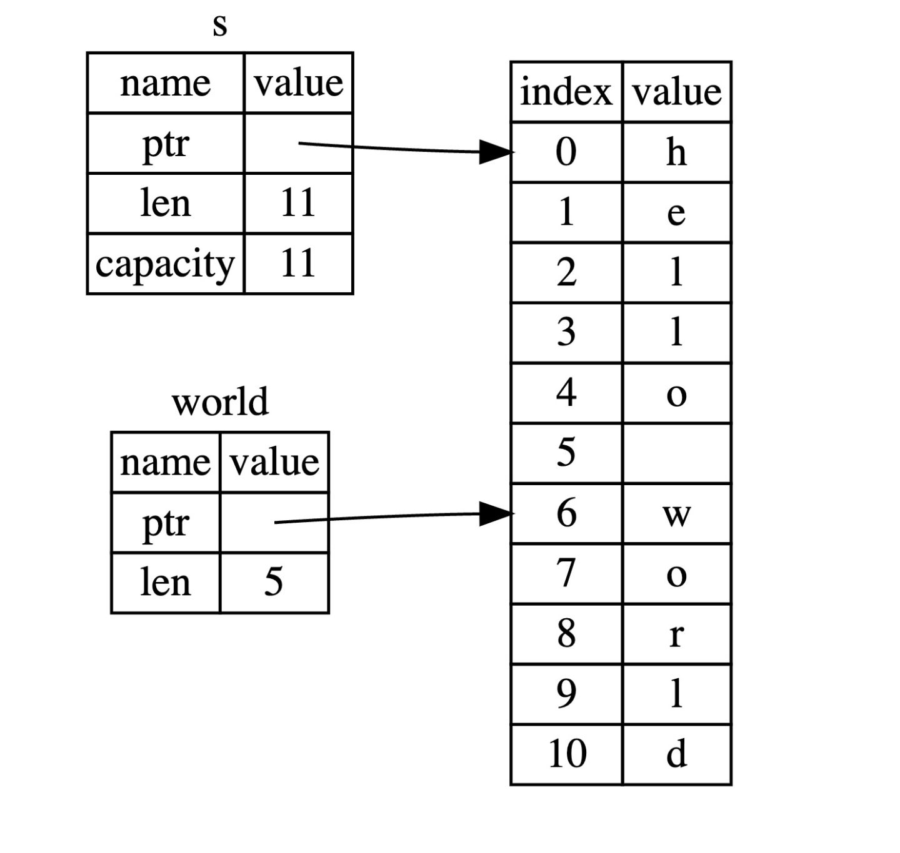
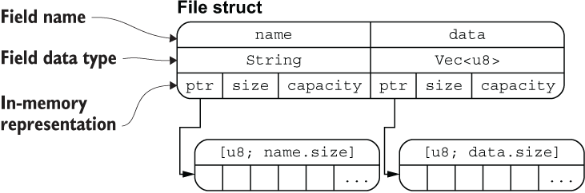

# 复合类型

复合类型是其他类型组合而成的，最典型的就是结构体`struct`和枚举`enum`。例如平面上的一个点`point(x, y)`，它是由两个数值类型组成，单独一个数值是不完整的，无法标识一个点，应该把它看作一个整体去理解和处理。

# 字符串

字符串在其他语言中相对单一简单，但在Rust中却相对复杂，下面看一个例子：

```rust
fn main() {
  let my_name = "Pascal";
  greet(my_name);
}

fn greet(name: String) {
  println!("Hello, {}!", name);
}
```

看似简单，但是无法通过编译：

```rust
error[E0308]: mismatched types
 --> src/main.rs:3:11
  |
3 |     greet(my_name);
  |           ^^^^^^^
  |           |
  |           expected struct `std::string::String`, found `&str`
  |           help: try using a conversion method: `my_name.to_string()`

error: aborting due to previous error
```

编译器提示 `greet` 函数需要一个 `String` 类型的字符串，却传入了一个 `&str` 类型的字符串。可见在Rust中，字符串的表示方式有很多种。


## 切片（slice）

切片不是Rust独有的概念，在Go语言中也有切片，它允许你引用集合中部分连续的元素序列，而不必引用整个集合。

对字符串而言，切片就是对`String`类型中某一部分的引用，看起来像这样：

```rust
let s = String::from("hello world");

let hello = &s[0..5];
let world = &s[6..11];
```

这就是创建切片的语法，使用方括号包括的一个序列: **[开始索引..终止索引]**，索引是闭开区间。

对于 `let world = &s[6..11];` 来说，`world` 是一个切片，该切片的指针指向 `s` 的第 7 个字节(索引从 0 开始, 6 是第 7 个字节)，且该切片的长度是 `5` 个字节。内存布局如下图：




在使用 Rust 的 `..` `range序列`语法时，如果你想从索引 0 开始，可以使用如下的方式，这两个是等效的：

```rust
let s = String::from("hello");

let slice = &s[0..2];
let slice = &s[..2];
```

同样的，如果你的切片想要包含 `String` 的最后一个字节，则可以这样使用:

```rust
let s = String::from("hello");

let len = s.len();

let slice = &s[4..len];
let slice = &s[4..];
```

也可以截取完整的 `String` 切片：

```rust
let s = String::from("hello");

let len = s.len();

let slice = &s[0..len];
let slice = &s[..];
```

> 在对字符串使用切片语法时需要格外小心，切片的索引必须落在字符之间的边界位置，也就是UTF8字符的边界，例如中文在UTF8中占用三个字节,下面的代码就会崩溃:
>
> ```rust
>  let s = "中国人";
>  let a = &s[0..2];
>  println!("{}",a);
> ```
>
> 如果改成 `&s[0..3]`，则可以正常通过编译。 因此，当你需要对字符串做切片索引操作时，需要格外小心这一点。


### 其他切片

因为切片是对集合的部分引用，因此不仅仅字符串有切片，其它集合类型也有，例如数组：

```rust
let a = [1, 2, 3, 4, 5];

let slice = &a[1..3];

assert_eq!(slice, &[2, 3]);
```

该数组切片的类型是 `&[i32]`，数组切片和字符串切片的工作方式是一样的，例如持有一个引用指向原始数组的某个元素和长度。


## 字符串字面量是切片

之前提到过字符串字面量，但是没有提到它的类型：

```rust
let s = "Hello, world!";
```

实际上，`s` 的类型是 `&str`，也可以这样声明：

```rust
let s: &str = "Hello, world!";
```

该切片指向了程序可执行文件中的某个点，这也是为什么字符串字面量是不可变的，因为 `&str` 是一个不可变引用。


## 什么是字符串？

字符串是由字符组成的连续集合，但**Rust中字符是Unicode类型，因此每个字符占4个字节内存空间，但字符串不一样，字符串是UTF8编码，也就是字符所占字节数是变化的（1-4）**，这样有助于大幅降低字符串所占用的内存空间。

Rust 在语言级别，只有一种字符串类型： `str`，它通常是以引用类型出现 `&str`，也就是上文提到的字符串切片。虽然语言级别只有上述的 `str` 类型，但是在标准库里，还有多种不同用途的字符串类型，其中使用最广的即是 `String` 类型。

`str` 类型是硬编码进可执行文件，也无法被修改，但是 `String` 则是一个可增长、可改变且具有所有权的 UTF8 编码字符串，**当 Rust 用户提到字符串时，往往指的就是 `String` 类型和 `&str` 字符串切片类型，这两个类型都是 UTF8 编码**。

除了 `String` 类型的字符串，Rust 的标准库还提供了其他类型的字符串，例如 `OsString`， `OsStr`， `CsString` 和` CsStr` 等，这些名字都以 `String` 或者 `Str` 结尾，它们分别对应的是具有所有权和被借用的变量。


### 操作字符串

由于 `String` 是可变字符串，因此我们可以对它进行创建、增删操作，下面的代码汇总了相关的操作方式：

```rust
fn main() {
    // 创建一个空String
    let mut s = String::new();
    // 将&str类型的"hello,world"添加到s中
    s.push_str("hello,world");
    // 将字符'!'推入s中
    s.push('!');
    // 最后s的内容是"hello,world!"
    assert_eq!(s,"hello,world!");

    // 从现有的&str切片创建String类型
    let mut s = "hello,world".to_string();
    // 将字符'!'推入s中
    s.push('!');
    // 最后s的内容是"hello,world!"
    assert_eq!(s,"hello,world!");

    // 从现有的&str切片创建String类型
    // String与&str都是UTF8编码，因此支持中文
    let mut s = String::from("你好,世界");
    // 将字符'!'推入s中
    s.push('!');
    // 最后s的内容是"你好,世界!"
    assert_eq!(s,"你好,世界!");

    let s1 = String::from("hello,");
    let s2 = String::from("world!");
    // 在下句中，s1的所有权被转移走了，因此后面不能再使用s1
    let s3 = s1 + &s2; // note s1 has been moved here and can no longer be used
    assert_eq!(s3,"hello,world!");
    // 下面的语句如果去掉注释，就会报错
    // println!("{}",s1);
}
```

在上面代码中，有一处需要解释的地方，就是使用 `+` 来对字符串进行相加操作， 这里之所以使用 `s1 + &s2` 的形式，是因为 `+` 使用了 `add` 方法，该方法的定义类似：

```rust
fn add(self, s: &str) -> String {
```

由此可推，以下代码也是合法的：

```rust
let s1 = String::from("tic");
let s2 = String::from("tac");
let s3 = String::from("toe");

// String = String + &str + &str + &str + &str
let s = s1 + "-" + &s2 + "-" + &s3;
```

`String + &str`返回一个 `String`，然后再继续跟一个 `&str` 进行 `+` 操作，返回一个 `String` 类型，不断循环，最终生成一个 `s`，也是 `String` 类型。


### String与&str的转换

从`&str`类型生成`String`类型操作：

* `String::from("hello, world")`
* `"hello, world".to_string()`

将`String`类型转为`&str`类型，很简单，取引用即可：

```rust
fn main() {
    let s = String::from("hello,world!");
    say_hello(&s);
    say_hello(&s[..]);
    say_hello(s.as_str());
}

fn say_hello(s: &str) {
    println!("{}",s);
}
```

实际上这种灵活用法是因为 `deref` 隐式强制转换，具体我们会在 **Deref特征**进行详细讲解。


## 字符串索引

在其它语言中，使用索引的方式访问字符串的某个字符或者子串是很正常的行为，但是在 Rust 中就会报错:

```rust
let s1 = String::from("hello");
let h = s1[0];
```

该代码会产生如下错误：

```rust
3 |     let h = s1[0];
  |             ^^^^^ `String` cannot be indexed by `{integer}`
  |
  = help: the trait `Index<{integer}>` is not implemented for `String`
```

#### 深入字符串内部

字符串的底层的数据存储格式实际上是[ `u8` ]，一个字节数组。对于 `let hello = String::from("Hola");` 这行代码来说， `hello` 的长度是 `4` 个字节，因为 `"hola"` 中的每个字母在 UTF8 编码中仅占用 1 个字节，但是对于下面的代码呢？

```rust
let hello = String::from("中国人");
```

如果问你该字符串多长，你可能会说 `3`，但是实际上是 `9` 个字节的长度，因为每个汉字在 UTF8 中的长度是 `3` 个字节，因此这种情况下对 `hello` 进行索引，访问 `&hello[0]` 没有任何意义，因为你取不到 `中` 这个字符，而是取到了这个字符三个字节中的第一个字节，这是一个非常奇怪而且难以理解的返回值。


#### 字符串的不同表现形式

现在看一下用梵文写的字符串 `“नमस्ते”`, 它底层的字节数组如下形式：

```rust
[224, 164, 168, 224, 164, 174, 224, 164, 184, 224, 165, 141, 224, 164, 164,
224, 165, 135]
```

长度是18个字节，这也是计算机最终存储该字符串的形式。

如果从字符的形式去看，则是：

```rust
['न', 'म', 'स', '्', 'त', 'े']
```

但是这种形式下，第四和六两个字母根本就不存在，没有任何意义。

再从字母串的形式去看：

```rust
["न", "म", "स्", "ते"]
```

所以，可以看出来 Rust 提供了不同的字符串展现方式，这样程序可以挑选自己想要的方式去使用，而无需去管字符串从人类语言角度看长什么样。

还有一个原因导致了 Rust 不允许去索引字符：因为索引操作，我们总是期望它的性能表现是 O(1)，然而对于 `String` 类型来说，无法保证这一点，因为 Rust 可能需要从 0 开始去遍历字符串来定位合法的字符。


## 字符串切片

因为切片的索引是通过字节来进行，但是字符串又是 UTF8 编码，因此你无法保证索引的字节刚好落在字符的边界上，例如：

```rust
let hello = "中国人";

let s = &hello[0..2];
```

运行上面的程序，会直接造成崩溃：

```rust
thread 'main' panicked at 'byte index 2 is not a char boundary; it is inside '中' (bytes 0..3) of `中国人`', src/main.rs:4:14
note: run with `RUST_BACKTRACE=1` environment variable to display a backtrace
```

这里提示的很清楚，我们索引的字节落在了 `中` 字符的内部，这种返回没有任何意义。

因此在通过索引区间来访问字符串时，**需要格外的小心**，一不注意，就会导致你程序的崩溃！


## 操作UTF8字符串

### 字符

以Unicode字符方式遍历字符串，可以使用`chars`方法：

```rust
for c in "中国人".chars() {
    println!("{}", c);
}
```

输出如下：

```rust
中
国
人
```


### 字节

返回字符串底层字节数组表现形式:

```rust
for b in "中国人".bytes() {
    println!("{}", b);
}
```

输出如下：

```rust
228
184
173
229
155
189
228
186
186
```


### 获取字串

想要准确的从UTF8字符串中获取子串是较为复杂的事情，例如想要从 `holla中国人नमस्ते` 这种变长的字符串中取出某一个子串，使用标准库是做不到的。需要在 `crates.io` 上搜索 `utf8` 来寻找想要的功能。

可以考虑尝试下这个库:[utf8_slice](https://crates.io/crates/utf8_slice)。


## 字符串深度剖析

为啥`String`可变，而字符串字面值`str`却不可以？ 

就字符串字面值来说，在编译时就知道其内容，最终被直接硬编码进可执行文件中，这使得其快速且高效，这主要得益于字符串的不可变性。不幸的是，不能为了获得这种性能，而把每一个在编译时大小未知的文本都放进内存中（你也做不到！），因为有的字符串是在程序运行得过程中动态生成的。

对于 `String` 类型，为了支持一个可变、可增长的文本片段，需要在堆上分配一块在编译时未知大小的内存来存放内容，这些都是在程序运行时完成的：

* 首先向操作系统请求内存来存放 `String` 对象
* 在使用完成后，将内存释放，归还给操作系统

其中第一个由 `String::from` 完成，它创建了一个全新的 `String`。

重点来了，到了第二部分，就是百家齐放的环节，在有**垃圾回收 GC** 的语言中，GC 来负责标记并清除这些不再使用的内存对象，这个过程都是自动完成，无需开发者关心，非常简单好用；但是在无 GC 的语言中，需要开发者手动去释放这些内存对象。

对于 Rust 而言，安全和性能是写到骨子里的核心特性，如果使用 GC，那么会牺牲性能；如果使用手动管理内存，那么会牺牲安全，这该怎么办？为此，Rust 的开发者想出了一个无比惊艳的办法：变量在离开作用域后，就自动释放其占用的内存：

```rust
{
    let s = String::from("hello"); // 从此处起，s 是有效的

    // 使用 s
}                                  // 此作用域已结束，
                                   // s 不再有效，内存被释放
```

与其它系统编程语言的 `free` 函数相同，Rust 也提供了一个释放内存的函数： `drop`，但是不同的是，其它语言要手动调用 `free` 来释放每一个变量占用的内存，而 Rust 则在变量离开作用域时，自动调用 `drop` 函数: 上面代码中，Rust 在结尾的 `}` 处自动调用 `drop`。

> 其实，在 C++ 中，也有这种概念: *Resource Acquisition Is Initialization (RAII)*。


这个模式对编写 Rust 代码的方式有着深远的影响， 后续进行更深入的学习。


# 元组

* 元组是由多种类型组合而成，因此是复合类型，其长度固定，元素顺序也固定。

* 创建一个元组：

  ```rust
  fn main() {
      let tup: (i32, f64, u8) = (500, 6.4, 1);
  }
  ```

  元组使用括号将多个类型组合到一起。

* 可以用模式匹配或者`.`操作符来获取元组中的值


## 用模式匹配解构元组

```rust
fn main() {
    let tup = (500, 6.4, 1);
    let (x, y, z) = tup;
    println!("The value of y is: {}", y);
}
```

元组中对应的值会绑定到变量 `x`， `y`， `z`上。这就是解构：用同样的形式把一个复杂对象中的值匹配出来。


## 用`.`来访问元组

模式匹配可以一次性把元组中值全部或部分获取出来，如果只想访问某个特定元素，模式匹配就略显繁琐了，因此Rust提供了`.`的方式访问：

```rust
fn main() {
    let x: (i32, f64, u8) = (500, 6.4, 1);

    let five_hundred = x.0;
    let six_point_four = x.1;
    let one = x.2;
}
```

和其它语言的数组、字符串一样，元组的索引从 0 开始。


## 元组的使用示例

元组在函数返回值场景很常见，可以使用元组返回多个值：

```rust
fn main() {
    let s1 = String::from("hello");
    
    let (s2, len) = calculate_length(s1);
    println!("The length of '{}' is {}.", s2, len);
}

fn calculate_length(s: String) -> (String, usize) {
    let length = s.len();
    
    (s, length)
}
```

在其他语言中，可以用结构体来声明一个三维空间中的点，例如 `Point(10, 20, 30)`，虽然使用 Rust 元组也可以做到：`(10, 20, 30)`，但是这样写有个非常重大的缺陷：

**不具备任何清晰的含义**，在下一章节中，会提到一种与元组类似的结构体， `元组结构体`，可以解决这个问题。


# 结构体

上节提到需要更高级的数据结构来更好的抽象问题，结构体`struct`就是这样的复合数据结构，它是由其他数据类型组合而来。

结构体和元组有些相像：都是有多种类型组合而成。但是与元组不同，结构体可以为内部的每个字段起一个富有含义的名称。因此结构体更加灵活强大，其不依赖字段顺序来访问和解析。


## 结构体语法

* 结构体定义:

  ```rust
  struct User {
      active: bool,
      username: String,
      email: String,
      sign_in_count: u64,
  }
  ```

  结构体名称是`User`，拥有4个字段，且都有自己的名字及类型声明。

* 创建结构体实例

  ```rust
  let user1 = User {
      email: String::from("someone@example.com"),
      username: String::from("someusername123"),
      active: true,
      sign_in_count: 1,
  };
  ```

  有几点注意：

  1. 初始化实例时，**每个字段**都需要初始化
  2. 初始化时的字段顺序**不需要**和结构体定义时的顺序一致

* 访问结构体字段

  ```rust
  let mut user1 = User {
      email: String::from("someone@example.com"),
      username: String::from("someusername123"),
      active: true,
      sign_in_count: 1,
  };
  
  user1.email = String::from("anotheremail@example.com");
  ```

  注意：需要将结构体实例声明为可变的，才能修改其中的字段，Rust不支持将结构体字段标记为可变。

* 简化结构体创建

  ```rust
  fn build_user(email: String, username: String) -> User {
      User {
          email,
          username,
          active: true,
          sign_in_count: 1,
      }
  }
  ```

  如上所示，当函数参数和结构体同名时，可以直接使用缩略的方式进行初始化。

* 结构体更新语法
  在实际场景中：根据已有的结构体实例，创建新的结构体实例较为常见，例如：

  ```rust
  let user2 = User {
      active: user1.active,
      username: user1.username,
      email: String::from("another@example.com"),
      sign_in_count: user1.sign_in_count,
  };
  ```

  这样是OK的，但是有些啰嗦，好在Rust为我们提供了更简单的`结构体更新语法`：

  ```rust
  let user2 = User {
      email: String::from("another@example.com"),
      ..user1
  };
  ```

  `..` 语法表明凡是我们没有显示声明的字段，全部从 `user1` 中自动获取。需要注意的是 `..user1` 必须在结构体的尾部使用。

  > 结构体更新跟赋值语句`=`非常像，因此`user1`的部分字段所有权被转移到了`user2`中：`username`字段发生了所有权转移，作为结果，`user1`无法再被使用。
  >
  > 为什么只有`username`字段发生了转移？回想所有权那一节内容，提到了`Copy`特征：实现了`Copy`特征的类型无需所有权转移，可以直接在赋值时进行数据拷贝，其中`bool`和`u64`类型就实现了`Copy`特征，因此`active`和`sign_in_count`仅仅发生了拷贝，而不是所有权转移。
  >
  > 注意：`username`所有权转移给了`user2`，导致`user1`无法使用，但并不代表`user1`内部其他字段不能被继续使用，例如：

```rust
let user1 = User {
    email: String::from("someone@example.com"),
    username: String::from("someusername123"),
    active: true,
    sign_in_count: 1,
};
let user2 = User {
    email: String::from("another@example.com"),
    ..user1
};
println!("{}", user1.active);
// 下面这行会报错
println!("{:?}", user1);
```


## 结构体的内存排列

下面代码：

```rust
#[derive(Debug)]
struct File {
   name: String,
   data: Vec<u8>,
}
 
fn main() {
   let f1 = File {
     name: String::from("f1.txt"),
     data: Vec::new(),
   };
 
   let f1_name = &f1.name;
   let f1_length = &f1.data.len();
 
   println!("{:?}", f1);
   println!("{} is {} bytes long", f1_name, f1_length);
}
```

上面定义的 `File` 结构体在内存中的排列如下图所示：



从图中可以清晰的看出 `File` 结构体两个字段 `name` 和 `data` 分别拥有底层两个 `[u8]` 数组的所有权(`String` 类型的底层也是 `[u8]` 数组)，通过 `ptr` 指针指向底层数组的内存地址，这里你可以把 `ptr` 指针理解为 Rust 中的引用类型。

该图片也侧面印证了：**把结构体中具有所有权的字段转移出去后，将无法再访问该字段，但是可以正常访问其它的字段**。


## 元组结构体（Tuple Struct）

结构体必须要有名称，但结构体字段可以没有名称，长的像元组，因此被称为元组结构体。实例：

```rust
struct Color(i32, i32, i32);
struct Point(i32, i32, i32);

let black = Color(0, 0, 0);
let origin = Point(0, 0, 0);
```

在希望有一个整体的名称，又不关心字段名字时非常有用。例如上面的`Point`元组结构体，众所周知3D点是`(x, y, z)`形式坐标点，无需再为内部字段命名。


## 元结构体(Unit-like Struct)

元结构体是没有任何字段和属性的结构体。

如果定义一个类型，不关心其内容，只关心它的行为，就可以使用`元结构体`：

```rust
struct AlwaysEqual;

// 我们不关心 AlwaysEqual 的字段数据，只关心它的行为，因此将它声明为元结构体，然后再为它实现某个特征
impl SomeTrait for AlwaysEqual {
    
}
```


## 结构体数据的所有权

在之前的`User`中，我们使用了自身拥有所有权的`String`类型，而不是基于引用的`&str`字符串切片类型。

也可以让结构体从其他对象借用数据，不过这样做，就需要引入`生命周期`这个新概念，简而言之，生命周期能确保结构体的作用范围要比它所借用的数据的作用范围要小。

总之，如果你想在结构体中使用一个引用，就必须加上生命周期，否则就会报错：

```rust
struct User {
    username: &str,
    email: &str,
    sign_in_count: u64,
    active: bool,
}

fn main() {
    let user1 = User {
        email: "someone@example.com",
        username: "someusername123",
        active: true,
        sign_in_count: 1,
    };
}
```

```rust
error[E0106]: missing lifetime specifier
 --> src/main.rs:2:15
  |
2 |     username: &str,
  |               ^ expected named lifetime parameter // 需要一个生命周期
  |
help: consider introducing a named lifetime parameter // 考虑像下面的代码这样引入一个生命周期
  |
1 ~ struct User<'a> {
2 ~     username: &'a str,
  |
```

在后续的`生命周期`中会再来学习如何修复这个问题。

