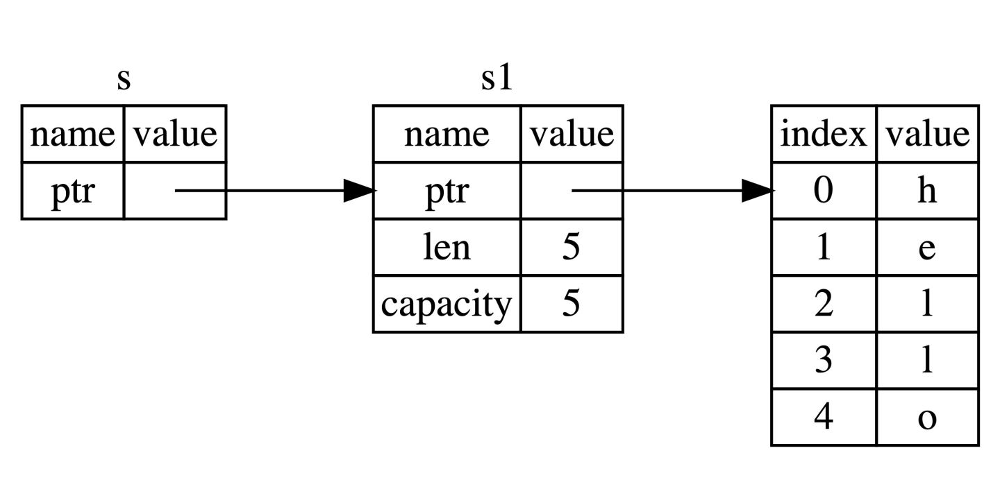

# 所有权和借用

在以往，内存安全几乎都是通过GC的方式实现的，但GC会带来性能、内存占用等问题，在高性能及系统编程场景是不可接受的，因此Rust采用了与众不同的方式：**所有权系统**。

因此理解**所有权**和**借用**，对学习Rust至关重要。


# 所有权

## 栈（Stack）与堆（Heap）

栈是一种后进先出的结构，栈中的数据必须占用已知且固定大小的内存空间。

与栈不同，对于大小未知或者可能变化的数据，我们需要将它放在堆上。

当向堆上放入数据时，需要请求一定大小的内存空间。操作系统在堆的某处找到一块足够大的空位，把它标记为已使用，并返回一个表示该位置地址的**指针**, 该过程被称为**在堆上分配内存**，有时简称为 “分配”（allocating）。

接着，该指针会被推入**栈**中，因为指针的大小是已知且固定的，在后续使用过程中，你将通过栈中的**指针**，来获取数据在堆上的实际内存位置，进而访问该数据。

### 性能区别

写入方面：入栈比在堆上分配内存要快，因为入栈时操作系统无需分配新的空间，只需要将数据放入栈顶即可。在堆上分配内存操作系统必须先找到一块足够存放数据的内存空间，接着做一些记录为下次分配做准备。

读取方面：得益于CPU高速缓存，处理器可以减少对内存的访问，其差异在10倍以上。栈数据往往可以直接存处在高速缓存中，而堆数据常存储在内存中。访问堆上的数据须先访问栈，再通过其指针来访问堆上内存，因此访问堆比栈慢。

### 所有权与堆栈

当调用一个函数时，传递给函数的参数（包括可能指向堆上数据的指针和函数的局部变量）依次被压入栈中，当函数调用结束时，这些值将被从栈中按照相反的顺序依次移除。

因为堆上的数据缺乏组织，因此跟踪这些数据何时分配和释放是非常重要的，否则堆上的数据将产生内存泄漏 —— 这些数据将永远无法被回收。这就是 Rust 所有权系统为我们提供的强大保障。


# 所有权原则

* Rust中每一个值都**有且只有**一个所有者（变量）
* 当所有者（变量）离开作用域时，这个值将被丢失（free）

## 简单介绍String类型

字符串字面值`let s = "hello"`，`s`是被硬编码进程序里的字符串值（类型为`&str`）。字符串字面值是很方便的，但是它不适用于所有场景。原因有二：

* **字符串字面值是不可变的**，因为被硬编码到程序代码中
* 并非所有字符串的值都能在编写时得知

为此Rust为我们提供了动态字符串类型：`String`，该类型被分配到堆上，因此可以动态伸缩，也就能存储编译时大小未知的文本。

* 基于字符串字面量创建`String`类型：`let s = String::from("hello");`

* 修改`String`类型：

  ```rust
  let mut s = String::from("hello");
  
  s.push_str(", world!"); // push_str() 在字符串后追加字面值
  
  println!("{}", s); // 将打印 `hello, world!`
  ```

  

# 变量绑定背后的数据交互

## 转移所有权

看一段代码：

```rust
let x = 5;
let y = x;
```

因为整数是 Rust 基本数据类型，是固定大小的简单值，因此这两个值都是通过自动拷贝的方式来赋值的，都被存在栈中，完全无需在堆上分配内存。

对于这种简单类型，拷贝的速度远比在堆上创建内存来得快的多。实际上，上一章我们讲到的 Rust 基本类型都是通过自动拷贝的方式来赋值的，就像上面代码一样。

另外一段代码：

```rust
let s1 = String::from("hello");
let s2 = s1;
```

`String` 不是基本类型，而且是存储在堆上的，因此不能自动拷贝。实际上， `String` 类型是一个复杂类型，由**存储在栈中的堆指针**、**字符串长度**、**字符串容量**共同组成，其中**堆指针**是最重要的，它指向了真实存储字符串内容的堆内存，至于长度和容量，如果你有 Go 语言的经验，这里就很好理解：容量是堆内存分配空间的大小，长度是目前已经使用的大小。

下面对上面代码中的 `let s2 = s1` 分成两种情况讨论：

1. 拷贝 `String` 和存储在堆上的字节数组。 如果该语句是拷贝所有数据(深拷贝)，那么无论是 `String` 本身还是底层的堆上数据，都会被全部拷贝，这对于性能而言会造成非常大的影响
2. 只拷贝 `String` 本身。 这样的拷贝非常快，因为在 64 位机器上就拷贝了 `8字节的指针`、`8字节的长度`、`8字节的容量`，总计 24 字节，但是带来了新的问题，还记得我们之前提到的所有权规则吧？其中有一条就是：**一个值只允许有一个所有者**，而现在这个值(堆上的真实字符串数据)有了两个所有者：`s1` 和 `s2`。

好吧，就假定一个值可以同时拥有两个所有者，会发生什么？

当变量离开作用域后，Rust会自动调用`drop`函数并清理变量的堆内存（因为Rust是没有GC的，如果不这样，又会导致引入引用计数等GC算法来清理内存）。不过由于两个`String`变量都指向同一位置，当它们离开作用域，都会尝试释放相同的内存。这是一个叫**二次释放（double free）**的错误，也是之前提过内存安全BUG之一。

因此，Rust 这样解决问题：**当 `s1` 赋予 `s2` 后，Rust 认为 `s1` 不再有效，因此也无需在 `s1` 离开作用域后 `drop` 任何东西，这就是把所有权从 `s1` 转移给了 `s2`，`s1` 在被赋予 `s2` 后就马上失效了**。

在所有权转移后再来使用旧的所有者，Rust编译器会报如下错误：

```rust
error[E0382]: use of moved value: `s1`
 --> src/main.rs:5:28
  |
3 |     let s2 = s1;
  |         -- value moved here
4 |
5 |     println!("{}, world!", s1);
  |                            ^^ value used here after move
  |
  = note: move occurs because `s1` has type `std::string::String`, which does
  not implement the `Copy` trait
```


如果你在其他语言中听说过术语**浅拷贝( shallow copy )\**和\**深拷贝( deep copy )**，那么拷贝指针、长度和容量而不拷贝数据听起来就像浅拷贝，但是又因为Rust同时使第一个变量`s1`失效了，因此这个操作被称为**移动（move）**，而不是浅拷贝。上面的例子可以解读`s1`**移动**到了`s2`。具体发生了什么用一张图说明：


这样就解决了我们之前的问题，`s1` 不再指向任何数据，只有 `s2` 是有效的，当 `s2` 离开作用域，它就会释放内存。这就是为什么Rust称呼`let a = b`为**变量绑定**的原因。


## 克隆（深拷贝）

首先，**Rust永远不会默认创建数据的“深拷贝”**。因此，任何**自动**的复制都不是深拷贝，可以被认为对运行时性能影响较小。

如果我们**确实**需要深度复制`String`中堆上的数据，而不仅仅是栈上的数据，可以使用一个叫`clone`的方法：

```rust
let s1 = String::from("hello");
let s2 = s1.clone();

println!("s1 = {}, s2 = {}", s1, s2);
```

这段代码能够正常运行，因此说明 `s2` 确实完整的复制了 `s1` 的数据。

如果代码性能无关紧要，例如初始化程序时，或者在某段时间只会执行一次时，你可以使用 `clone` 来简化编程。但是对于执行较为频繁的代码(热点路径)，使用 `clone` 会极大的降低程序性能，需要小心使用！


## 拷贝（浅拷贝）

浅拷贝只发生在栈上，因此性能很高，在日常变成中，浅拷贝无处不在。

再看之前的例子：

```rust
let x = 5;
let y = x;

println!("x = {}, y = {}", x, y);
```

但这段代码似乎与我们刚刚学到的内容相矛盾：没有调用 `clone`，不过依然实现了类似深拷贝的效果 —— 没有报所有权的错误。

原因是像整型这样的基本类型在编译时是已知大小的，会被存储在栈上，所以拷贝其实际的值是快速的。这意味着没有理由在创建变量 `y` 后使 `x` 无效（`x`、`y` 都仍然有效）。换句话说，这里没有深浅拷贝的区别，因此这里调用 `clone` 并不会与通常的浅拷贝有什么不同，我们可以不用管它（可以理解成在栈上做了深拷贝）。

Rust有一个叫做`Copy`的特征（trait），可以用在类似整形这样在栈中存储的类型。如果一个类型拥有`Copy`特征，一个旧的变量在赋值给其他变量后任然可用。

那么什么类型是可`Copy`的呢？可以查看给定类型的文档来确认，不过作为一个通用规则：**任何基本类型的组合是`Copy`的，不需要分配内存或某种形式的资源的类型是`Copy`的**。如下是一些`Copy`类型：

* 所有整数类型。比如`u32`
* 布尔类型，bool。
* 所有浮点数类型。如`f64`
* 字符类型，`char`
* 元组，当且仅当其包含的类型也是`Copy`的时候。比如，`(i32, i32)` 是 `Copy` 的，但 `(i32, String)` 就不是。


# 函数传值与返回

将值传递给函数，一样会发生 `移动` 或者 `复制`，就跟 `let` 语句一样，下面的代码展示了所有权、作用域的规则：

```rust
fn main() {
    let s = String::from("hello");  // s 进入作用域

    takes_ownership(s);             // s 的值移动到函数里 ...
                                    // ... 所以到这里不再有效

    let x = 5;                      // x 进入作用域

    makes_copy(x);                  // x 应该移动函数里，
                                    // 但 i32 是 Copy 的，所以在后面可继续使用 x

} // 这里, x 先移出了作用域，然后是 s。但因为 s 的值已被移走，
  // 所以不会有特殊操作

fn takes_ownership(some_string: String) { // some_string 进入作用域
    println!("{}", some_string);
} // 这里，some_string 移出作用域并调用 `drop` 方法。占用的内存被释放

fn makes_copy(some_integer: i32) { // some_integer 进入作用域
    println!("{}", some_integer);
} // 这里，some_integer 移出作用域。不会有特殊操作
```


同样的，函数返回值也有所有权，例如:

```rust
fn main() {
    let s1 = gives_ownership();         // gives_ownership 将返回值
                                        // 移给 s1

    let s2 = String::from("hello");     // s2 进入作用域

    let s3 = takes_and_gives_back(s2);  // s2 被移动到
                                        // takes_and_gives_back 中,
                                        // 它也将返回值移给 s3
} // 这里, s3 移出作用域并被丢弃。s2 也移出作用域，但已被移走，
  // 所以什么也不会发生。s1 移出作用域并被丢弃

fn gives_ownership() -> String {             // gives_ownership 将返回值移动给
                                             // 调用它的函数

    let some_string = String::from("hello"); // some_string 进入作用域.

    some_string                              // 返回 some_string 并移出给调用的函数
}

// takes_and_gives_back 将传入字符串并返回该值
fn takes_and_gives_back(a_string: String) -> String { // a_string 进入作用域

    a_string  // 返回 a_string 并移出给调用的函数
}
```


所有权很强大，避免了内存的不安全性，但也带来了一个新的麻烦：**总是把一个值传来传去使用它**。

传入一个函数，很可能还要从函数传出去，结果就是语言表达变得非常啰嗦，幸运的是，Rust提供了新的功能解决这个问题。


# 引用与借用

Rust 通过`借用（Borrowing）`，这个概念来达到上节所说所有权的问题。**获取变量的引用，称之为借用(borrowing)。**


## 引用与解引用

常规引用是一个指针类型，指向了对象存储的内存地址。下面代码，创建了一个`i32`的引用`y`，然后使用解引用符解除`y`的值：

```rust
fn main() {
    let x = 5;
    let y = &x;

    assert_eq!(5, x);
    assert_eq!(5, *y);
}
```


## 不可变引用

下面代码，我们用`s1`的引用作为参数传递给了`calculate_length`函数，而没有转移所有权给该函数：

```rust
fn main() {
    let s1 = String::from("hello");

    let len = calculate_length(&s1);

    println!("The length of '{}' is {}.", s1, len);
}

fn calculate_length(s: &String) -> usize {
    s.len()
}
```

这里，`&` 符号即是引用，它们允许你使用值，但是不获取所有权，如图所示：



通过 `&s1` 语法，我们创建了一个 **指向s1的引用**，但是并不拥有它。因为并不拥有这个值，当引用离开作用域后，其指向的值也不会被丢弃。

如果我们尝试修改借用的变量：

```rust
fn main() {
    let s = String::from("hello");

    change(&s);
}

fn change(some_string: &String) {
    some_string.push_str(", world");
}
```

则会报错：

```rust
error[E0596]: cannot borrow `*some_string` as mutable, as it is behind a `&` reference
 --> src/main.rs:8:5
  |
7 | fn change(some_string: &String) {
  |                        ------- help: consider changing this to be a mutable reference: `&mut String`
                           ------- 帮助：考虑将该参数类型修改为可变的引用: `&mut String`
8 |     some_string.push_str(", world");
  |     ^^^^^^^^^^^ `some_string` is a `&` reference, so the data it refers to cannot be borrowed as mutable
                     `some_string`是一个`&`类型的引用，因此它指向的数据无法进行修改
```

正如变量默认不可变一样，引用指向的值默认也是不可变的，下面看如何解决这个问题。


## 可变引用

```rust
fn main() {
    let mut s = String::from("hello");

    change(&mut s);
}

fn change(some_string: &mut String) {
    some_string.push_str(", world");
}
```

首先，声明 `s` 是可变类型，其次创建一个可变的引用 `&mut s` 和接受可变引用的函数 `some_string: &mut String`。


### 可变引用同时只能存在一个

限制： **同一作用域，特定数据只能有一个可变引用**：

```rust
let mut s = String::from("hello");

let r1 = &mut s;
let r2 = &mut s;

println!("{}, {}", r1, r2);
```

以上代码会报错：

```rust
error[E0499]: cannot borrow `s` as mutable more than once at a time
```

这段代码出错的原因在于，第一个可变借用 `r1` 必须要持续到最后一次使用的位置 `println!`，在 `r1` 创建和最后一次使用之间，我们又尝试创建第二个可变引用 `r2`。

这种限制的好处就是使 Rust 在编译期就避免数据竞争，数据竞争可由以下行为造成：

* 两个或更多指针同时访问同一数据
* 至少一个指针被用来写入数据
* 没有同步数据访问机制

Rust 避免了数据竞争情况的发生，因为它甚至不会编译存在数据竞争的代码！

代码做如下修改就能通过编译：

```rust
fn main() {
        let mut s = String::from("hello");

        let r1 = &mut s;
        let r2 = &mut s;

        println!("{}", r2);
    }

```

也就是说，定义了`r2`后，不能再出现对`r1`的使用。这样就是安全的，就能通过编译。


### 可变引用与不可变引用不能同时存在

下面的代码会导致错误：

```rust
let mut s = String::from("hello");

let r1 = &s; // 没问题
let r2 = &s; // 没问题
let r3 = &mut s; // 大问题

println!("{}, {}, and {}", r1, r2, r3);
```

错误如下：

```rust
error[E0502]: cannot borrow `s` as mutable because it is also borrowed as immutable
```

这个也很好理解，正在借用不可变引用的用户，肯定不希望他借用的东西，被另外一个人莫名其妙改变了。多个不可变借用被允许是因为没有人会去试图修改数据，每个人都只读这一份数据而不做修改，因此不用担心数据被污染。

> 注意，引用的作用域 `&s` 从创建开始，一直持续到它最后一次使用的地方，这个跟变量的作用域有所不同，变量的作用域从创建持续到某一个花括号 `}`

改为如下代码即可：

```rust
fn main() {
   let mut s = String::from("hello");

    let r1 = &s; 
    let r2 = &s; 
    println!("{} and {}", r1, r2);

    let r3 = &mut s; 
    println!("{}", r3);
} 
```

虽然这种借用错误有的时候会让我们很郁闷，但是你只要想想这是 Rust 提前帮你发现了潜在的 BUG，其实就开心了，虽然减慢了开发速度，但是从长期来看，大幅减少了后续开发和运维成本。


## 悬垂引用（Dangling References）

悬垂引用也叫做悬垂指针，意思为指针指向某个值后，这个值被释放掉了，而指针仍然存在，其指向的内存可能不存在任何值或已被其它变量重新使用。

```rust
fn main() {
    let reference_to_nothing = dangle();
}

fn dangle() -> &String {
    let s = String::from("hello");

    &s
}
```

当我们尝试创建一个悬垂引用，Rust 会抛出一个编译时错误：

```rust
error[E0106]: missing lifetime specifier
 --> src/main.rs:5:16
  |
5 | fn dangle() -> &String {
  |                ^ expected named lifetime parameter
  |
  = help: this function's return type contains a borrowed value, but there is no value for it to be borrowed from
help: consider using the `'static` lifetime
  |
5 | fn dangle() -> &'static String {
  |                ~~~~~~~~

```

错误信息引用了一个我们还未介绍的功能：`生命周期（lifetimes）`。不过，即使你不理解生命周期，也可以通过错误信息知道这段代码错误的关键信息：

```rust
this function's return type contains a borrowed value, but there is no value for it to be borrowed from.
该函数返回了一个借用的值，但是已经找不到它所借用值的来源
```

一个很好的解决方法是直接返回`String`:

```rust
fn no_dangle() -> String {
    let s = String::from("hello");

    s
}
```

这样就没有任何错误了，最终 `String` 的 **所有权被转移给外面的调用者**。


## 借用规则总结

* 同一时刻，只能拥有要么一个可变引用，要么任意多个不可变引用
* 引用必须总是有效的

