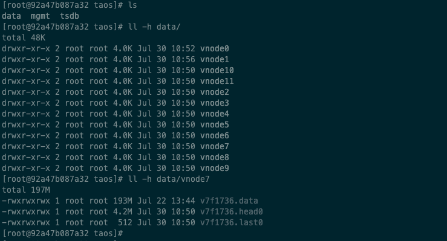

# TDengine问题总结

通过回答问题的方式学习TDengine。

## 为什么一个设备一张表？

这种设计能保证一个采集点的数据在存储介质上是一块一块连续的，大幅减少随机读取操作，成数量级的提升读取和查询速度。
而且由于不同数据采集设备产生的数据的过程是完全独立，每个设备只产生属于自己的数据，一张表也就只有一个写入者。
这样每个表就可以采用无锁方式来写，写入速度就能大幅提升。
同时，对于一个数据采集点而言，其产生的数据是时序的，因此写的操作可用追加的方式实现，进一步大幅提高数据写入速度。

这样做的限制：
假设了一张表只有一个写入者，因此采用无锁方式来写入，其实在实际场景不一定，比如我们IOT场景，就会有多个线程从kafka消费，数据并发的写入数据库。
而且产生的数据，时序也不一定是连续的，可能会有老的时间写入。


## 超级表的含义是什么？
官方定义：STable是同一类型数据采集点的抽象，是同类型采集实例的集合，包含多张数据结构一样的子表。

### 为什么需要超级表？
因为一个设备一张表的话，那么对一批设备做聚合查询就变得不可能。超级表就是为了解决这个问题的。

### 创建超级表：
```sql
CREATE TABLE <stable_name> (<field_name> TIMESTAMP, field_name1 field_type,…) TAGS(tag_name tag_type, …) 
```
这里的tags是设备的静态属性：如型号、颜色等。

### 创建表时可以指定超级表
```sql
CREATE TABLE <tb_name> USING <stb_name> TAGS (tag_value1,...)
```
比如：
```sql
CREATE TABLE t1 USING thermometer TAGS ('beijing', 10)  // 创建表时，tags就确定了。以超级表为模板创建普通表。
```

### 超级表的本质
超级表在本质上只是一个元信息存储，以及对元信息创建了内部的索引（比如从tag-->table的映射关系），元信息都是存储在内存中的。超级表的存在是为了多表聚合查询。


## TDengin写入流程是怎么样的？


数据在服务器端，先写入commit log，再写入对应vnode的cache中，然后对客户端返回成功。cache数据落盘策略分为时间驱动的落盘和数据驱动的落盘。

正常写入由于要求时间戳一定是递增的，因此数据落盘时，只需要进行append操作，无需做排序去重和compaction。

### vnode的文件结构


data目录：真正存储数据的地方

mgmt目录：存储系统元信息的地方（比如数据库，表，tag索引信息）

tsdb目录：存放vnode的元信息（创建时间，配置信息，vnode的统计信息等以及该vnode中表的信息）、commit-log

重点关注data目录，data下面分为多个vnode，vnode内部包含3中类型文件：.data, .head, .last

#### .data文件是什么？
.data文件是真正的数据文件，以数据块的方式进行组织，该文件只进行追加操作。内容组织形式大致如下：

```text
<文件开始>
[文件头]
[数据块1]
[数据块2]
...
[数据块N]
<文件结尾>
```

一个数据块只包含一张表的数据，数据块中的数据按列组织排放。每个块内容组织形式大致如下：

```text
[列1信息]
[列2信息]
...
[列N信息]
[列1数据]
[列2数据]
...
[列N数据]
```


#### .head文件是什么？
.head文件中存放了对应.data文件中数据块的索引信息。该文件组织形式如下：

```text
<文件开始>
[文件头]
[表1偏移量]
[表2偏移量]
...
[表N偏移量]
[表1数据索引]
[表2数据索引]
...
[表N数据索引]
<文件结尾>
```

文件开头的偏移量列表表示对应表的数据索引块的开始位置在文件中的偏移量。每张表的数据索引信息在head文件中都是连续存放的。

表的数据索引块组织形式：

```text
[索引块信息]
[数据块1索引]
[数据块2索引]
...
[数据块N索引]
```

其中，索引块信息中记录了数据块的个数等描述信息。每个数据块索引对应一个在data文件或last文件中的一个单独的数据块。
索引信息中记录了数据块存放的文件、数据块起始位置的偏移量、数据块中数据时间主键的范围等。索引信息也是按时间排序的。


#### .last文件是什么？
为了防止数据块的碎片化，提高查询速度和压缩率，TDengine引入了last文件。
当要落盘的数据块中的数据条数低于某个阈值时，TDengine会先将该数据块写入到last文件中进行暂时存储。
当有新的数据需要落盘时，last文件中的数据会被读取出来与新数据组成新的数据块写入到data文件中。
last文件的组织形式与data文件类似。


### 分多个vnode的好处
1. 分多个vnode可以使备份和水平扩展更容易
2. 由于TDengine没有compaction过程，相对来说，磁盘IO会更小，在磁盘IO不成问题的情况下，通过并发的写多个文件，可以进一步榨取磁盘的性能。


## TDengine的查询流程是怎么样的？


### 客户端
1. SQL解析
2. 查询请求执行器
3. 结果聚合

SQL解析器负责对SQL语句进行解析校验，并转化为抽象语法树，查询执行器负责将抽象语法树转化查询执行逻辑，
并根据SQL语句查询条件，将其转换为针对管理节点元数据查询和针对数据节点的数据查询两级查询处理。

TDengine由于不支持复杂的SQL查询（比如子查询，join查询等），因此基本上不存在查询计划优化的问题，所以可以这样做，
但是这样也同样限制了，整体的灵活性和后续的扩展重构等。


### 管理节点

管理节点保存了整个集群系统的全部数据的元数据信息，向客户端节点提供查询所需的数据的元数据。
通过超级表包含了通过该超级表创建的所有表的信息，因此查询处理器（Query Executor）负责针对标签（TAG）的查询处理，并将满足标签查询请求的表信息返回给客户端。


### 数据节点

客户端接收到的查询处理请求都统一放置到处理队列中，查询执行器从队列中获得查询请求，并负责执行。
通过查询优化器（Query Optimizer）对于查询进行基本的优化处理，以及通过数据节点的查询执行器（Query Executor）扫描符合条件的数据单元并返回计算结果。


### 一个查询的例子

```sql
SELECT COUNT(*) 
FROM FOO_SUPER_TABLE
WHERE TAG_LOC = 'beijing' AND TS >= '2019-01-12 00:00:00' AND TS < '2019-01-13 00:00:00'
```
SQL语句向超级表 FOO_SUPER_TABLE 查询获取时间范围在2019年1月12日整天，标签TAG_LOC是'beijing'的表所包含的所有记录总数。

内部执行步骤：

1. 客户端解析SQL以及合法性检查，生成语法树，并提取查询对象——超级表FOO_SUPER_TABLE，然后向管理节点请求相应的元信息，并将过滤信息（TAG_LOC='beijing'）一并发送。

2. 管理节点接收到元数据查询请求，首先找到超级表 FOO_SUPER_TABLE 的基础信息，然后通过过滤条件（TAG）过滤出客户端需要的元信息并发送给客户端。

3. 客户端获取元信息后，查询执行器根据元数据中的数据分布，分别向保存有相应数据的节点发起查询请求，同时会带上时间戳查询条件。

4. 数据节点收到客户端的查询，转化为内部结构后将其放入任务执行队列，等待查询执行器执行。获得查询结构后，将结果返回给客户端。

5. 当所有查询涉及的数据返回后，客户端将每个数据节点的查询结果再次进行聚合（本案例就是将结果再次进行累加）。


### 查询的优化点
1. 数据和标签分离存储模式，极大降低标签数据的存储冗余度，并且全内存缓存。
2. 针对数据不可变的特点，在每个数据块上，都记录了该数据库中数据的最大值、最小值、和等统计数据。如果查询处理涉及到整个数据块，则直接使用预计算结果。
3. 对于某些查询，并不用等待全部查询结果生成后再返回结果。例如，列选取查询，当第一批查询结果获得以后，数据节点直接将其返回给客户端。


## TDengine为什么如此之快？
1. 一个设备一张表，服务端认为一张表只有一个写入者，因此可以无锁写入。
2. SQL语句解析是在客户端完成的，服务端无需解析SQL。客户端还完成了部分计算层的事，如数据聚合。
3. 数据是写入多个vnode（类似influxdb中的shard，相当于物理上的多个目录或多个文件），可以进一步压榨磁盘性能（如果磁盘够好的话），也可能降低锁争抢。
4. data数据文件，不需要compaction，数据写入，直接可以采用append方式。data数据文件的索引信息存储在单独的head文件中。
5. 预计算结果。
6. 最近一段的数据，缓存在内存中。


## 使用限制
1. select * from super_t order by time desc limit N; 此语句报错，无法跑出结果。（一万张子表，总共10亿条数据。）
2. 查询的不便，比如针对单表和多表，需要在两处做查询（原始表和超级表）。
3. 强制一个设备一张表，并且普通写入方式，无法写入老的数据。

