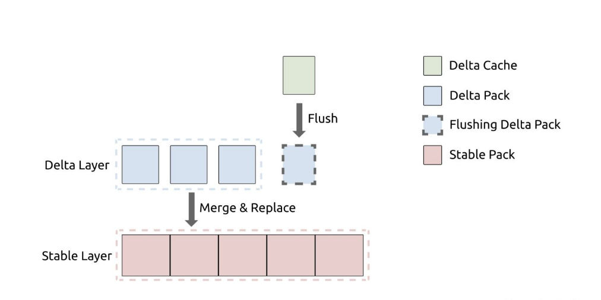

# TiFlash存储层学习笔记
TiFlash是一款列式存储引擎，支持实时更新，可以支持高TPS写入的同时，仍能保持良好的读性能。

其底层采用Delta Tree的存储结构。

## 整体架构是怎么样的?
Delta Tree的架构充分参考了B+ Tree和LSM Tree的设计思想。 

从整体上看Delta Tree将表数据按照主键进行range分区，切分后的数据块为Segment；然后Segment内部则采用了类LSM Tree的分层结构。 
分区可以减少每个区的数据量，降低复杂度。

整体看上去是一个B+ Tree结构，叶子节点以上是作为Segment的索引，用于快速定位到某个Segment。

由于一个Segment存储的数据量远大于传统B+ Tree的叶子节点，所以Segment总数不会特别大，
所以B+ Tree的非叶子节点（索引部分），可以全部加载进内存。 

和B+ Tree的叶子节点一样，Segment也支持Split、Merge，初始状态一张表的只存在一个range为[-∞,+∞]的Segment。

## 一个Segment内部的架构是怎么样的?

在Segment内部Delta Tree是类似LSM的分层数据组织方式，因为一个Segment的数据量相对于传统的LSM小很多，所以Delta Tree只需要固定的两层，
即Delta Layer和Stable Layer，分别对应LSM Tree的L0和L1。 层数越少，写放大也就越小。 

## 一个Segment的大小是多少?
Segment的切分粒度通常在150万行左右， 单机Segment总数通常在10万以内，

一个Segment是否和TiKV里面的Region一一对应？ 如果不是那一个Segment的数据量大小大概是多少？完全只是按照行数进行划分Segment吗？

## Segment内部文件数据内容的组织管理方式是怎么样的?
Segment 内部的数据管理单位是 Pack，通常一个 Pack 包含 8K 行或者更多的数据。 Pack的数据也是由列数据组成，每个列是一个一维数组。

Pack除了主键列和Schema包含的列之外，还包含version和del_mark列；version是事务的commit时间戳，用来实现MVCC； 
del_mark为bool值，用来标志这一行是否已经被删除。

Pack是作为IO和索引过滤的单位，因为数据分析场景，获取数据的方式都是Scan，为了提高Scan的性能，通常IO块要比较大，每次可以读取一个或者多个Pack。
数据分析场景，行级别的精确索引用处不大，因此实现了一些粗糙的索引，比如Min-Max索引，这类索引的过滤单位也是Pack。

(这类索引是放在哪里的?)

Delta Tree 的 Pack 内部的数据是以 (PK, version) 组合字段按升序排序的，与 TiKV 内的数据顺序一致。
这样可以让 TiFlash 无缝接入 TiDB 集群，复用原来的 Region 调度机制。

(组合字段按升序排序?列存怎么升序排序，列名都是以(PK,version)开头? 
另外怎么复用Region的调度机制?把Segment的一部分数据split出来，可以调度到其他机器上吗?)

### Delta Layer
Delta Layer相当于LSM的第0层，可以认为是对Segment的增量更新，所以叫Delta。 
数据先写入Delta Cache(和Memtable类似)，写满后会被刷入磁盘上的Delta Layer; 
Delta Layer写满后会与Stable Layer做一次Merge得到新的Stable Layer。

### Stable Layer
Stable Layer相当于 LSM Tree 的 L1，是存放 Segment 的大部分数据的地方。 
它由一个不可修改的文件存储，称为 DTFile。 一个 Segment 只有一个 DTFile。

Stable Layer 同样由 Pack 组成，并且数据以 (PK, version) 组合字段按升序排序。
不一样的是，Stable Layer 中的数据是全局有序，而 Delta Layer 则只保证 Pack 内有序。 
因为Stable Layer是做Merge生成的，所以自然就实现了全局有序。

当 Segment 的总数据量超过配置的容量上限，就会以 Segment range 的中点为分裂点，进行 split，分裂成两个 Segment；
如果相邻的两个 Segment 都很小，则可能会被 merge 在一起，变成一个 Segment。

