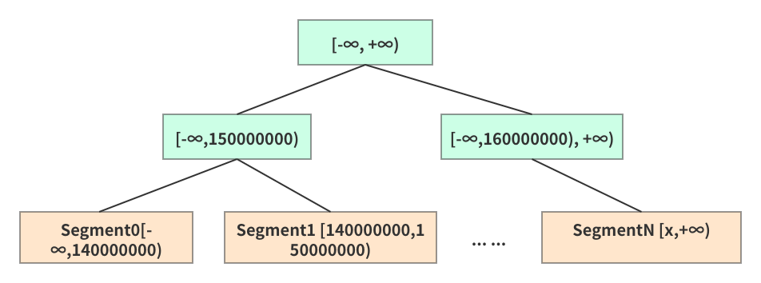

# TiFlash存储层学习笔记
TiFlash是一款列式存储引擎，支持实时更新，可以支持高TPS写入的同时，仍能保持良好的读性能。

其底层采用Delta Tree的存储结构。

## 整体架构是怎么样的?
Delta Tree的架构充分参考了B+ Tree和LSM Tree的设计思想。 

从整体上看Delta Tree将表数据按照主键进行range分区，切分后的数据块为Segment；然后Segment内部则采用了类LSM Tree的分层结构。 
分区可以减少每个区的数据量，降低复杂度。

整体看上去是一个B+ Tree结构，叶子节点以上是作为Segment的索引，用于快速定位到某个Segment。

由于一个Segment存储的数据量远大于传统B+ Tree的叶子节点，所以Segment总数不会特别大，
所以B+ Tree的非叶子节点（索引部分），可以全部加载进内存。 

和B+ Tree的叶子节点一样，Segment也支持Split、Merge，初始状态一张表的只存在一个range为[-∞,+∞]的Segment。

## 一个Segment的大小是多少?
Segment的切分粒度通常在150万行左右， 单机Segment总数通常在10万以内，
一个Segment是否和TiKV里面的Region一一对应？ 如果不是那一个Segment的数据量大小大概是多少？完全只是按照行数进行划分Segment吗？

